

[Seite: 1]

BBW Berufsbildungsschule Winterthur

Abteilung Maschinenbau

# Skript Mathematik und Physik

Produktionsmechaniker/in und Gussformer/in 1. Semester

Ausgabe für Lehrpersonen

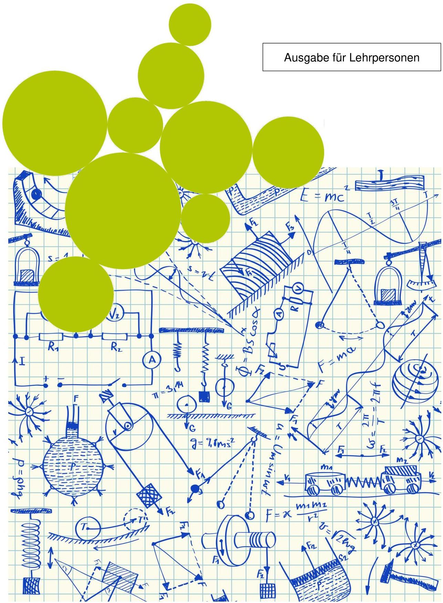

> **Bildbeschreibung:**
> Das Bild zeigt eine kreative und komplexe Darstellung, die an eine Mischung aus physikalischen und mathematischen Konzepten erinnert. Hier sind die wichtigsten Elemente und Details:
> 
> 1. **Hintergrund und Rahmen:**
>    - Der Hintergrund besteht aus einem karierten Muster, das an ein Notizbuch oder ein Arbeitsblatt erinnert.
>    - Oben rechts befindet sich ein Textfeld mit der Aufschrift "Ausgabe für Lehrpersonen", was darauf hindeutet, dass das Bild für Lehrkräfte bestimmt ist.
> 
> 2. **Zeichnungen und Symbole:**
>    - Das Bild ist voller detaillierter Skizzen und Notizen in Blau.
>    - Es gibt zahlreiche physikalische Darstellungen wie Kraftpfeile, Hebel, Federkraft, Schwerkraft, und verschiedene Arten von Bewegungen.
>    - Es sind auch mechanische Systeme wie Zahnräder, Seilzüge, und einfache Maschinen abgebildet.
>    - Mathematische Formeln und Gleichungen sind ebenfalls zu sehen, darunter die berühmte Einstein-Gleichung \(E = mc^2\).
> 
> 3. **Kreise:**
>    - Im Vordergrund sind mehrere große gelbe Kreise, die sich über die Skizzen legen. Diese Kreise könnten als Platzhalter oder Fokuspunkte für bestimmte Themen oder Konzepte dienen.
> 
> 4. **Kontext:**
>    - Der Kontext deutet darauf hin, dass es sich um ein Lehrmaterial handelt, das physikalische und mathem

---

[Seite: 2]

BBW Berufsbildungsschule Winterthur Abteilung Maschinenbau

# Inhaltsverzeichnis

0 Infos zum 1. Semester Mathematik und Physik ...2
0.1 Material für den Unterricht ...2
0.2 Themenvorgabe gemäss Lehrplan ...2
0.3 Weiterführende Links ...2

1 Zahlen, Zahlendarstellung, Gebrauch des Taschenrechners ...3
1.1 Die sieben Rechenoperationen ...4
1.2 Das griechische Alphabet ...4
1.3 Rundungsregeln ...5
1.4 Taschenrechner ...6

2 Grundoperationen ...9
2.1 Addition ...9
2.2 Subtraktion ...10
2.3 Multiplikation ...12
2.4 Division ...15

3 Dreisatz ...17
3.1 Proportionaler Zusammenhang ...17
3.2 Umgekehrt proportionaler Zusammenhang ...18
3.3 Übungsaufgaben Dreisatz ...19

4 Physikalische Grundlagen ...21
4.1 Rechnen mit physikalischen Grössen und Einheiten ...22

5 Gleichförmige Bewegung ...27
5.1 Gleichförmige gradlinige Bewegung ...27
5.2 Definition der Geschwindigkeit ...28
5.3 Gleichförmige Kreisbewegung ...32
5.4 Zusatzaufgaben Kapitel 5, Prüfungsvorbereitung ...35

Skript MAPH 1. Sem. PR-GF Lehrer, V1.0

---

[Seite: 3]

BBW Berufsbildungsschule Winterthur Abteilung Maschinenbau

# 0 Infos zum 1. Semester Mathematik und Physik

Der MAPH-Unterricht findet im ersten Semester während zwei Lektionen pro Woche statt. Im Rahmen dieses Unterrichtes werden mindestens drei bewertete Lernzielkontrollen (Prüfungen) durchgeführt.

# 0.1 Material für den Unterricht

Für den Unterricht benötigen Sie das nachfolgend aufgeführte Material:

- Laptop
- Taschenrechner
- Formeln und Tabellen (Swissmem)
- Skript

# 0.2 Themenvorgabe gemäss Lehrplan

## Mathematik

- Zahlen, Zahlendarstellung
- Gebrauch des Taschenrechners
- Grundrechenoperationen
- Dreisatz

## Physik

- Physikalische Grundlagen
- Gleichförmig geradlinige Bewegungen berechnen
- Geschwindigkeits-Zeit-Diagramm lesen und interpretieren
- Gleichförmige Kreisbewegungen berechnen

# 0.3 Weiterführende Links

In diesem Skript gibt es zu einzelnen Themen und Stichworten weiterführende Links. Diese erkennen sie am **braun und kursiv** geschriebenen Text.

Skript MAPH 1. Sem. PR-GF Lehrer, V1.0

---

[Seite: 4]

BBW Berufsbildungsschule Winterthur Abteilung Maschinenbau

# 1 Zahlen, Zahlendarstellung, Gebrauch des Taschenrechners

Gerechnet werden kann nicht nur mit Zahlen, sondern auch mit „Buchstaben“. Die allgemein gültigen Rechenregeln gelten dann aber genauso. Diese Rechenregeln werden wir nachfolgend noch einmal bei Ihnen auffrischen.

## Benannte und unbenannte Zahlen

### Unbenannte Zahlen

Eine unbenannte Zahl ist eine Zahl, die sich nicht auf eine bestimmte Art von Dingen bezieht, die gezählt werden. Beispiele sind:

3, 138, 75

### Benannte Zahlen

Damit sind Zahlen gemeint, die sich auf bestimmte Einheiten beziehen. Sie entstehen beim Zählen und Messen von Längen, Zeiten, Temperaturen, usw.

13cm, 55°C, 20kg

Es können nur gleichbenannte Einheiten miteinander verrechnet werden.

1,5m+3m=4,5m

Sind Einheiten zusätzlich mit Einheitsvorsätzen versehen, so müssen diese zuerst umgerechnet werden.

75g+1,2kg=75g+1200g=1275g

## Symbole

In der Mathematik werden häufig Symbole und Zeichen verwendet. Um Berechnungen durchführen, oder Resultate richtig beschreiben zu können, ist es notwendig, dass man die Wichtigsten kennt.

|  Symbol | Bedeutung  |
| --- | --- |
|  = | gleich  |
|  ≠ | ungleich  |
|  + | plus  |
|  - | minus  |
|  : / - ÷ | geteilt durch  |
|  · x | mal  |
|  √a | Wurzel  |
|  a² | Potenz  |
|  () [] {} | zusammengehörende Einheit  |
|  Symbol | Bedeutung  |
| --- | --- |
|  < | kleiner als ...  |
|  > | grösser als ...  |
|  ≤ | kleiner oder gleich  |
|  ≥ | grösser oder gleich  |
|  => | daraus folgt ...  |
|  Δ | Differenz  |
|  ≈ | ungefähr  |
|  |   |
|  |   |

Skript MAPH 1. Sem. PR-GF Lehrer, V1.0

---

[Seite: 5]

BBW Berufsbildungsschule Winterthur
Abteilung Maschinenbau

# 1.1 Die sieben Rechenoperationen

Treffen in einer Rechnung verschiedene Rechenoperationen aufeinander, so muss beim Lösen die Hierarchie dieser Operationen in der Reihenfolge berücksichtigt werden. Rechnungen einer höheren Stufe müssen zuerst gelöst werden (z.B. Punkt vor Strich)

|   | Rechenart | Beispiel | 1. Zahl | 2. Zahl | Resultat  |
| --- | --- | --- | --- | --- | --- |
|  Stufe 1 | Addition | 3 + 6 = 9 | 3 = Summand | 6 = Summand | 9 = Summe  |
|   |  Subtraktion | 8 - 5 = 3 | 8 = Minuend | 5 = Subtrahend | 3 = Differenz  |
|  Stufe 2 | Multiplikation | 3 · 2 = 6 | 3 = Faktor | 2 = Faktor | 6 = Produkt  |
|   |  Division | 8 : 2 = 4 | 8 = Dividend | 2 = Divisor | 4 = Quotient  |
|  Stufe 3 | Potenzieren | 2³ = 8 | 2 = Basis | 3 = Exponent | 8 = Potenz  |
|   |  Radizieren | 3/27 = 3 | 3 = Wurzelexponent | 27 = Radikant | --  |
|   |  Logarithmieren | log₁₀(100) = 2 | 10 = Basis | 100 = Numerus | --  |

# 1.2 Das griechische Alphabet

Für geometrische und physikalische Größen werden häufig griechische Buchstaben verwendet. Die wichtigsten sollte man mit der Zeit kennen und wissen wofür sie stehen. Nachfolgend sind alle griechischen Buchstaben (gross und klein) aufgeführt. Sie finden daneben auch Hinweise auf die wichtigsten Verwendungen.

|  Buchstabe |   | Name | Verwendung grosser Buchstabe | Verwendung kleiner Buchstabe  |
| --- | --- | --- | --- | --- |
|  A | α | Alpha |  | Winkel  |
|  B | β | Beta |  | Winkel  |
|  Γ | γ | Gamma |  | Winkel  |
|  Δ | δ | Delta | Differenz | Winkel  |
|  E | ε | Epsilon |  | Dehnung  |
|  Z | ζ | Zeta |  |   |
|  H | η | Eta |  | Wirkungsgrad  |
|  Θ | θ | Theta |  | Temperatur  |
|  I | ι | Jota |  |   |
|  K | κ | Kappa |  |   |
|  Λ | λ | Lamda |  | Wellenlänge, Wärmeleitfähigkeit  |
|  M | μ | My |  | Zahlenvorsatz 1/1000, Reibungszahl  |
|  N | ν | Ny |  |   |
|  Ξ | ξ | Xi |  |   |
|  O | ο | Omrikon |  |   |
|  Π | π | Pi |  | Kreiszahl  |
|  P | ρ | Rho |  | Dichte  |
|  Σ | σ | Sigma | Summe | Zugspannung  |
|  T | τ | Tau | Temperatur, Periodendauer | Schubspannung  |
|  Y | υ | Ypsilon |  |   |
|  Φ | φ | Phi |  | Winkel in Polarkoordinaten  |
|  X | χ | Chi |  |   |
|  Ψ | ψ | Psi |  |   |
|  Ω | ω | Omega | El. Widerstand | Winkelgeschwindigkeit  |

Skript MAPH 1. Sem. PR-GF Lehrer, V1.0
MT
4/37

---

[Seite: 6]

BBW Berufsbildungsschule Winterthur Abteilung Maschinenbau

# 1.3 Rundungsregeln

Resultate müssen meistens gemäss untenstehender Regel gerundet werden, da es keinen Sinn macht, zehn Stellen nach dem Komma zu notieren. Im Normalfall gibt man für Endresultate zwei Stellen nach dem Komma an.

## Rundungsregeln

Je nach verlangter Genauigkeit muss entweder das Resultat oder müssen die einzelnen Zahlen, mit denen gerechnet wird, gerundet werden. Dabei gelten folgende Regeln:

- Folgt auf die letzte zu behaltende Ziffer eine 0, 1, 2, 3, 4 oder eine aufgerundete 5, so bleibt sie unverändert.

$$
\begin{array}{l}
5,314 \approx 5,31 \\
5,3148 \approx 5,31 \\
\end{array}
$$

- Ist die erste nicht beibehaltene Ziffer eine abgerundete 5, eine 6, 7, 8 oder 9, dann wird die letzte beibehaltene Ziffer um 1 vergrössert.

$$
\begin{array}{l}
5,466 \approx 5,47 \\
5,4654 \approx 5,47 \\
\end{array}
$$

- Ist die erste nicht beibehaltene Ziffer genau 5, so wird die letzte beibehaltene Ziffer um 1 vergrössert.

$$
\begin{array}{l}
3,785 \approx 3,79 \\
3,735 \approx 3,74 \\
\end{array}
$$

## 1.3.1 Übungsaufgaben Runden

Runden Sie folgende Resultate auf zwei Stellen nach dem Komma.

|  1,752 | = 1,75 | 125,898m | = 125,90m  |
| --- | --- | --- | --- |
|  0,02345 | = 0,02 | 0,9999J | = 1.00J  |
|  723,055 | = 723,06 | 103,095kg | = 103,10kg  |
|  0,10082 | = 0,10 | 1,456N | = 1,46N  |
|  202,606 | = 202,61 | 98,098V | = 98,10V  |
|  0,09999 | = 0,10 | 13'004km | = 13,00km  |
|  10,1010 | = 10,10 | 0,02058A | = 0,02A  |

Skript MAPH 1. Sem. PR-GF Lehrer, V1.0

---

[Seite: 7]

BBW Berufsbildungsschule Winterthur Abteilung Maschinenbau

# 1.4 Taschenrechner

Ihr Taschenrechner muss für den Einsatz an unserer Schule über einige grundlegende Funktionen verfügen. Diese werden nachfolgend beschrieben.

1. Quadrat
2. n-te Potenz
3. Kehrwert
4. Pi (π)
5. Quadratwurzel
6. n-te Wurzel
7. Klammern
8. Speichertasten
9. Winkel- und Zeitformat
10. Exponentialdarstellung

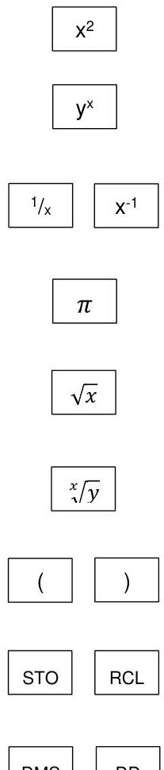

> **Bildbeschreibung:**
> Das Bild zeigt eine Auswahl von Tasten eines wissenschaftlichen Taschenrechners. Hier sind die wichtigsten Elemente und der sichtbare Text im Detail:
> 
> 1. **x²**: Eine Taste für die Quadratfunktion.
> 2. **y^x**: Eine Taste für die Potenzfunktion, die y zur Potenz von x erhebt.
> 3. **1/x** und **x⁻¹**: Zwei Tasten für die Kehrwertfunktion, wobei die erste Taste den Kehrwert von x direkt angibt und die zweite Taste x in die Potenz -1 erhebt.
> 4. **π**: Eine Taste für die mathematische Konstante Pi.
> 5. **√x**: Eine Taste für die Quadratwurzel von x.
> 6. **x√y**: Eine Taste für die Wurzel von y, potenziert mit x.
> 7. **()**: Zwei Tasten für runde Klammern, die zur Strukturierung von mathematischen Ausdrücken verwendet werden.
> 8. **STO**: Eine Taste, die wahrscheinlich zum Speichern eines Wertes in einem Speicher des Rechners dient.
> 9. **RCL**: Eine Taste, die vermutlich zum Abrufen eines gespeicherten Wertes aus dem Speicher dient.
> 10. **RND** und **EE**: Die Tasten sind teilweise sichtbar, wobei "RND" für Runden und "EE" für wissenschaft

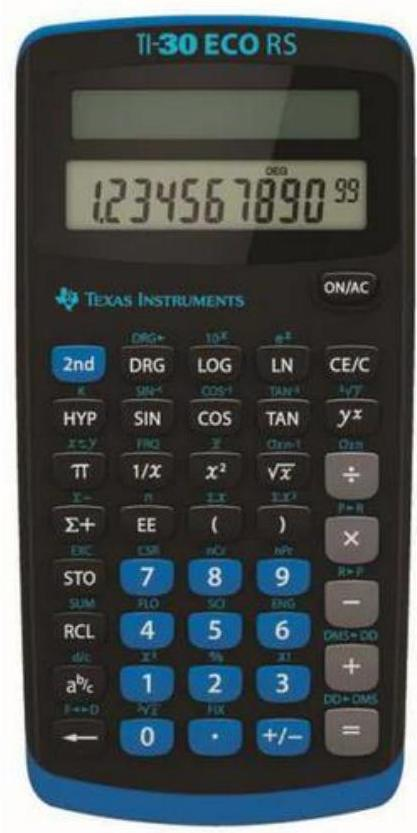

> **Bildbeschreibung:**
> Das Bild zeigt einen Taschenrechner der Marke Texas Instruments, Modell TI-30 ECO RS. Der Taschenrechner ist in einer Kombination aus Blau und Silber gehalten und befindet sich in einem leicht schrägen Winkel, sodass die Vorderseite mit den Tasten und dem Display gut sichtbar ist.
> 
> Das Display des Taschenrechners zeigt die Zahlenfolge "1234567890.99". Die Tasten sind in verschiedenen Farben und Größen angeordnet, um die Benutzerfreundlichkeit zu erhöhen. Einige der Tasten haben zusätzliche Funktionen, wie z.B. die Taste für die Quadratwurzel (√), die Taste für die Potenzierung (x^y), und die Taste für den natürlichen Logarithmus (ln).
> 
> Der Taschenrechner verfügt über eine Reihe von wissenschaftlichen Funktionen, wie z.B. die Berechnung von Sinus, Cosinus, Tangens, und Logarithmen. Diese Funktionen sind auf den Tasten mit den entsprechenden Symbolen (sin, cos, tan, log) gekennzeichnet.
> 
> Der Text "Texas Instruments" und "TI-30 ECO RS" sind auf dem Taschenrechner deutlich zu erkennen, was die Marke und das Modell des Geräts bestätigt.

Skript MAPH 1. Sem. PR-GF Lehrer, V1.0

MT

---

[Seite: 8]

BBW Berufsbildungsschule Winterthur
Abteilung Maschinenbau

Wichtigste Funktionen

|   | Funktion |   | Eingabe am Taschenrechner  |   |   |   |   |   |   |   |   |   |   |   |   |   |   |   |   |   |   |   |   |   |   |   |   |   |   |   |   |   |   |   |   |   |   |   |   |
| --- | --- | --- | --- | --- | --- | --- | --- | --- | --- | --- | --- | --- | --- | --- | --- | --- | --- | --- | --- | --- | --- | --- | --- | --- | --- | --- | --- | --- | --- | --- | --- | --- | --- | --- | --- | --- | --- | --- | --- |
|  1. |  | Quadriert die eingegebene Zahl | 12 | 2. |  | Berechnet die n-te Potenz einer Zahl | 2 | 3. |  | Berechnet den Kehrwert einer Zahl. | 3 | 4. |  | Berechnen von Umfang oder Kreisfläche | 12· | 5. |  | Zieht die zweite Wurzel einer Zahl | 16 | 6. |  | Zieht die n-te Wurzel aus einer Zahl | 8 | 7. |  | Fasst eine Operation zusammen. Übergeht dabei die Hierarchie der Rechenoperationen. | 20: | 8. |  | STO speichert ein Ergebnis auf dem zugewiesenen Platz. In unserem Beispiel auf Platz 1. RCL ruft dieses Ergebnis wieder ab. | 17 | 9. |  | DD Rechnet Winkel- oder Zeitformate in Dezimalzahlen um, oder umgekehrt mit DMS | 12,25 12°15'00" | 10. |  | Stellt Zahlen in Exponential-Schreibweise dar. | 3  |

Skript MAPH 1. Sem. PR-GF Lehrer, V1.0
MT
7/37

---

[Seite: 9]

BBW Berufsbildungsschule Winterthur Abteilung Maschinenbau

# 1.4.1 Übungsaufgaben Taschenrechner

Berechnen Sie mit dem Taschenrechner. Versuchen Sie die Berechnungen, ohne dass Sie sich Zwischenresultate notieren.

1.  $\sqrt{19}$
2.  $\sqrt{13 + 14}$
3.  $\sqrt{\frac{1}{2 + 5}}$
4.  $12^{2} + 2,37^{2}$
5.  $\frac{1}{7,3^2}$
6.  $25 - [7 + (24 - 13,83) - (2,5 + 2,6 + 2,7)]$
7.  $45 - (2^{3} - 3^{2}) - [3^{2} + 0,63(0,5 + 0,16)]$
8.*  $\frac{1}{\frac{1}{2} - \frac{1}{7} - \frac{1}{12} - \frac{1}{25}}$
9.  $1 \cdot 10^{7} + 23 \cdot 10^{4} + 3,7 \cdot 10^{3}$
10.  $8,3 \cdot 10^{-3} + 12 \cdot 10^{-6} + 236 \cdot 10^{-4}$
11.  $10^{2} \cdot 10'000 \cdot 10^{-2}$
12.  $128\mathrm{cm} + 1,4\mathrm{mm} + 4,55\mathrm{dm} = ?\mathrm{cm}$
13.  $\sqrt[3]{125}$
14.  $7^{2} + 5^{2} - \sqrt{20} -\sqrt[3]{8}$
15.  $3,33\mathrm{km} + 325\mathrm{m} - 0,004\mathrm{km} + 15,8\mathrm{dm} + 7,5\mathrm{m} = ?\mathrm{m}$
16.  $0,1\mathrm{kg} + 4\mathrm{g} - 0,133\mathrm{g} + 600\mathrm{mg} = ?\mathrm{g}$

4,36
5,2
0,378
150
0,0188
15,63
36,85
4,28
10,2·10⁶
0,0319
10'000
173,64cm
5
67,528
3660m
105g

Skript MAPH 1. Sem. PR-GF Lehrer, V1.0

---

[Seite: 10]

BBW Berufsbildungsschule Winterthur Abteilung Maschinenbau

# 2 Grundoperationen

## 2.1 Addition

|  a | + | b | = | c  |
| --- | --- | --- | --- | --- |
|  Summand |  | Summand |  | Summe  |

## Kommutativgesetz (Vertauschungsgesetz)

**Regel**
In einer Addition dürfen die Summanden beliebig vertauscht werden. Die Summe ändert sich dabei nicht.

Bsp.:
$$
7 + 2 = 2 + 7
$$
$$
a + b = b + a
$$
$$
x + y + z = z + x + y
$$

## Assoziativgesetz (Verbindungsgesetz)

**Regel**
In einer Addition dürfen die Summanden beliebig zu Teilsummen zusammengeführt werden. Die Summe ändert sich dabei nicht.

Bsp.:
$$
(6 + 2) + 5 = 6 + (2 + 5)
$$
$$
(a + b) + c = a + (b + c)
$$

## Abgekürzte Summe

**Regel**
Gleiche Summanden dürfen in einer Addition zusammengeführt werden. Die Summe ändert sich dabei nicht.

Bsp.:
$$
x = a + b + c + a + c + a + b + c + b + b + c + c
$$
$$
x = a + a + a + b + b + b + b + c + c + c + c + c \quad (\text{Kommutativgesetz})
$$
$$
x = 3a + 4b + 5c
$$

Skript MAPH 1. Sem. PR-GF Lehrer, V1.0
MT
9/37

---

[Seite: 11]

BBW Berufsbildungsschule Winterthur Abteilung Maschinenbau

## 2.2 Subtraktion

|  a | - | b | = | c  |
| --- | --- | --- | --- | --- |
|  Minuend |  | Subtrahend |  | Differenz  |

**Kommutativgesetz** (Vertauschungsgesetz) gilt bei der Subtraktion nicht!

Bsp.: 7 - 2 ≠ 2 - 7
a - b ≠ b - a
x - y - z ≠ z - x - y

**Assoziativgesetz** (Verbindungsgesetz) gilt bei der Subtraktion nicht!

Bsp.: (6 - 2) - 5 ≠ 6 - (2 - 5)
(a - b) - c ≠ a - (b - c)

## 2.2.1 Auflösen und Setzen von Klammern

Werden Teile einer Addition oder Subtraktion mit Klammern zusammengefasst, so müssen beim Berechnen bestimmte Regeln beachtet werden.

1. Wird bei einer Addition eine Klammer aufgelöst, so bleiben alle Vorzeichen gleich.

Bsp.: 6 + (2 + 5) = 6 + 2 + 5
a + (b + c) = a + b + c

2. Wird bei einer Subtraktion eine Klammer aufgelöst, so ändern sich alle Vorzeichen in der Klammer.

Bsp.: 6 - (2 + 5 - 3) = 6 - 2 - 5 + 3
a - (b + c - d) = a - b - c + d

3. Werden mehrere Klammern ineinander verschachtelt, so müssen diese von innen nach aussen gelöst werden. Dabei müssen bei jedem Schritt die beiden obigen Regeln beachtet werden.

Bsp.: 24 - {2 + 5 - (5 - 3) + 6} = 24 - {2 + 5 - 5 + 3 + 6} = 24 - 2 - 5 + 5 - 3 - 6 = 13
a - {b - (c + d) + e} = a - {b - c - d + e} = a - b + c + d - e

**Regel**

- Steht ein + vor einer Klammer, so ändern sich die Vorzeichen in der Klammer nicht.
- Steht ein – vor der Klammer, so werden in der Klammer alle Vorzeichen geändert.
- Sind mehrere Klammern verschachtelt, so werden diese von innen nach aussen gelöst. Die ersten beiden Regeln gelten dabei auch.

Skript MAPH 1. Sem. PR-GF Lehrer, V1.0
MT
10/37

---

[Seite: 12]

BBW Berufsbildungsschule Winterthur
Abteilung Maschinenbau

# 2.2.2 Übungsaufgaben Addition und Subtraktion

Lösen Sie folgende Aufgaben auf einem separaten Blatt und übertragen Sie das Resultat ins Skript.

1.  $9x + 3y + (2x - 2y)$
2.  $27 + (-2) - 7 + 9$
3.  $(23 + 2a + 17) - (23 - 2a + 17)$
4.  $-(2x - 8y) + 3y + (-2y + 3x)$
5.  $17m - 23m - (2m + (3m - 12m))$
6.  $2x - [4y - (2x - 3y) - 4x] - 6y$
7.  $a - \{[(3b + 2a) - 2b] - 3a\}$
8.  $11a - [(5a + 3b) - 5b - (4a + 5b)]$
9.  $-16 + (-25) - (-31) + (-21) - 12 + (-11) - 10$
10. $26a + (-12b) - (-30a) - (-12b) - (+10a) + 12b + 12a$
11. $14a - 9b + c - 5a - 3b - c - 9a - 12c - b + 4a$
12. $-(27a - 16b - 20c) - (5c - 20a + 13b)$
13. $10 - 20 - 30 - [40 - (50 - 60) - (70 - 80) - 90] - 100$
14. $25 + (-12) - (-31) + (-21) - 15 - 17 - (+21) + (-3) + 4 + (-5)$
15.*  $7 - \{-[-(26 + 37) + 25] - 12 + (-13)\} - 6$
16.*  $24a - [75a + (13a - b) - (7a + b)] + [12a - (15a - b) - 72b]$
17.*  $(15x - 23y) - [5x - (40x + 23y) - 20] - [-20x + (3x + y) - (40x - 20)]$
18.*  $24a - [75a + (13a - b) - (7a + b)] + [12a - (15a - b) - 72b]$

$= 11x + y$
$= 27$
$= 4a$
$= x + 9y$
$= -13m$
$= 8x - 13y$
$= 2a - b$
$= 10a + 7b$
$= -64$
$= 58a + 12b$
$= 4a - 13b - 12c$
$= -7a + 3b + 15c$
$= -110$
$= -34$
$= -12$
$= -60a - 69b$
$= 107x - y$
$= -60a - 69b$

Skript MAPH 1. Sem. PR-GF Lehrer, V1.0
MT
11/37

---

[Seite: 13]

BBW Berufsbildungsschule Winterthur
Abteilung Maschinenbau

# 2.3 Multiplikation

|  a | · | b | = | c  |
| --- | --- | --- | --- | --- |
|  Faktor |  | Faktor |  | Produkt  |

# Kommutativgesetz (Vertauschungsgesetz)

**Regel**
In einer Multiplikation dürfen die Faktoren beliebig vertauscht werden. Das Produkt ändert sich dabei nicht.

Bsp.:
7 · 2 = 2 · 7
a · b = b · a
x · y · z = z · x · y

# Assoziativgesetz (Verbindungsgesetz)

**Regel**
In einer Multiplikation dürfen die Faktoren beliebig zu Teilprodukten zusammengeführt werden. Das Endprodukt ändert sich dabei nicht.

Bsp.:
(6 · 2) · 5 = 6 · (2 · 5)
(a · b) · c = a · (b · c)

# Multiplikation mit 0

**Regel**
Ist ein Faktor in einer Multiplikation 0, so ist auch das Produkt 0.

Bsp.:
6 · 2 · 0 = 0
a · b · 0 = 0
a · 0 · 127 = 0

# Multiplikation von Variablen und Zahlen

**Regel**
Besteht eine Multiplikation aus Variablen und Zahlen, so werden die Zahlen zu Teilprodukten zusammengeführt (Assoziativgesetz) und die Variablen alphabetisch geordnet.

Bsp.:
a · 2 · c · 7 · b · 3 = 2 · 7 · 3 · a · b · c = 42abc (kein Operationszeichen = mal)

Skript MAPH 1. Sem. PR-GF Lehrer, V1.0
MT
12/37

---

[Seite: 14]

BBW Berufsbildungsschule Winterthur Abteilung Maschinenbau

# Vorzeichenregel bei Multiplikationen

|  Regel | (+a) · (+b) = (+ab) = ab | (-a) · (-b) = (+ab) = ab  |
| --- | --- | --- |
|   | (+a) · (-b) = (-ab) = -ab | (-a) · (+b) = (-ab) = -ab  |

Bsp.: (-c) · (-b) = bc
(-6) · 2 = -12
a · b · (-15) = -15ab

# Potenzschreibweise

|  Regel | Werden gleiche Variablen multipliziert, so schreibt man das Produkt als Potenz.  |
| --- | --- |

Bsp.: a · a · 3 = 3a²
2 · a · 2 · b · a · a = 2 · 2 · a · a · a · b = 4a³b

# Hierarchie der Operationen

|  Regel | Wenn nicht mit Klammern eine Reihenfolge vorgeschrieben ist, muss immer zuerst die Multiplikation und erst nachher die Addition oder Subtraktion ausgeführt werden.  |
| --- | --- |

Bsp.: 4 + 2 · 3 = 4 + 6 = 10
(4 + 2) · 3 = 6 · 3 = 18

# 2.3.1 Ausmultiplizieren

|  Regel | Man multipliziert eine Summe mit einem Faktor, indem man jedes Glied der Summe mit dem Faktor multipliziert und nachher die Produkte addiert.  |
| --- | --- |

Bsp.: (4 + 2) · 3 = 4 · 3 + 2 · 3 = 12 + 6 = 18
(a + b) · a = a · a + b · a = a² + ab
2a · (3b + 1) = 6ab + 2a
3ab · (a - b - 1) = 3a²b - 3ab² - 3ab

Skript MAPH 1. Sem. PR-GF Lehrer, V1.0
MT
13/37

---

[Seite: 15]

BBW Berufsbildungsschule Winterthur
Abteilung Maschinenbau

# 2.3.2 Übungsaufgaben Multiplikation

Lösen Sie folgende Aufgaben auf einem separaten Blatt und übertragen Sie das Resultat ins Skript.

1.  $9ax\cdot 2cy$  $= \underline{18acxy}$
2.  $3a\cdot 5y\cdot 6c\cdot 2b$  $= \underline{180abcy}$
3.  $16a\cdot (-7b)\cdot (-3c)$  $= \underline{336abc}$
4.  $(-2x)\cdot (+2y)\cdot (-3z)$  $= \underline{12xyz}$
5.  $8\cdot (3x + 4)$  $= \underline{24x + 32}$
6.  $3b\cdot (-4c)\cdot (-2d)\cdot (-1)$  $= \underline{-24bcd}$
7.  $(a + 3)\cdot 3bc$  $= \underline{3abc + 9bc}$
8.  $8\cdot (2a - 5b + 4c)$  $= \underline{16a - 40b + 32c}$
9.  $(5b + a - c)\cdot 5x$  $= \underline{5ax + 25bx - 5cx}$
10.  $(-7)\cdot (a + 2 - 9)$  $= \underline{-7a + 49}$
11.  $a\cdot (b + 2) + b(a + 2)$  $= \underline{2ab + 2a + 2b}$
12.  $7\cdot (a + b) - 2(a + 2)$  $= 5a + 7b - 4$
13.  $-(27x + 2y) - 8(2x + 2y)$  $= -43x - 18y$
14.  $(3a + 4b)\cdot (b - 11)$  $= \underline{3ab - 33a + 4b^2 - 44b}$
15.  $(4a - 5x)\cdot (5c + 4b)$  $= \underline{20ac + 16ab - 25cx - 20bx}$
16. *  $6a + 5ab - 3a\cdot (2 + 5b - c)$  $= \underline{-10ab + 3ac}$
17. *  $(x - 1)\cdot (x + 2 + y)$  $= \underline{x^2 + x + xy - y - 2}$
18. *  $2\cdot (a - b) - [3\cdot (a - b) - a]$  $= \underline{b}$

Skript MAPH 1. Sem. PR-GF Lehrer, V1.0
MT
14/37

---

[Seite: 16]

BBW Berufsbildungsschule Winterthur Abteilung Maschinenbau

## 2.4 Division

|  a | : | b | = | c  |
| --- | --- | --- | --- | --- |
|  Dividend |  | Divisor |  | Quotient  |

**Kommutativgesetz** (Vertauschungsgesetz) gilt bei der Division nicht!

Bsp.: a : b ≠ b : a
7 : 2 ≠ 2 : 7
x : y : z ≠ z : x : y

**Assoziativgesetz** (Verbindungsgesetz) gilt bei der Division nicht!

Bsp.: (a : b) : c ≠ a : (b : c)
(6 : 2) : 5 ≠ 6 : (2 : 5)

## Vorzeichenregel bei Divisionen

|  Regel | (+a) : (+b) = (+c) = c
(+a) : (-b) = (-c) = -c | (-a) : (-b) = (+c) = c
(-a) : (+b) = (-c) = -c  |
| --- | --- | --- |

Bsp.: $(-c):(-b) = \frac{c}{b}$
(-6): 2 = -3
$a \cdot b: (-15) = -\frac{a \cdot b}{15}$

Merke: Die Vorzeichen von Zähler und Nenner können miteinander vertauscht werden. Ein Vorzeichen vor dem Bruchstrich kann in den Zähler oder in den Nenner gebracht werden.

|  Regel | (+a): (-b) = (-a): (+b) = -\frac{a}{b} = \frac{-a}{b} = \frac{a}{-b}  |
| --- | --- |

## Spezialfälle der Division

1. 0 : a =&gt; Das Ergebnis ist 0, denn 0 · a ergibt 0.
2. a : 0 =&gt; Ist nicht ausführbar, denn es gibt kein Ergebnis, das mit 0 multipliziert a ergibt.
3. 0 : 0 =&gt; Ergibt kein bestimmtes Ergebnis, denn jede Zahl mit 0 multipliziert ergibt 0.

|  Regel | Durch 0 kann und darf nicht dividiert werden!  |
| --- | --- |

Skript MAPH 1. Sem. PR-GF Lehrer, V1.0
MT
15/37

---

[Seite: 17]

BBW Berufsbildungsschule Winterthur
Abteilung Maschinenbau

# 2.4.1 Übungsaufgaben Division

Lösen Sie folgende Übungsaufgaben ohne Taschenrechner.

1.  $18x:6$
2.  $18x:6x$
3.  $18:6x$
4.  $(-46abc):23ac$
5.  $4ab:(-2a)$
6.  $(-46abc):23ac$
7.  $(-144x^{2}y):(-36xy)$
8.  $12lmn^{2}:24ln$
9.  $17x:0$
10.  $0:17x$
11.  $16y - 4y - 8ay:4a$
12.  $27ef:9f - 36de:12d$

$= 3x$
$= 3$
$= \frac{18}{6x} = \frac{3}{x}$
$= -\frac{46abc}{23ac} = -2b$
$= \frac{4ab}{-2a} = \frac{-4ab}{2a} = -\frac{4ab}{2a} = -2b$
$= -\frac{46abc}{23ac} = -2b$
$= \frac{-144x^{2}y}{-36xy} = \frac{-144 \cdot x \cdot x \cdot y}{-36 \cdot x \cdot y} = 4x$
$= \frac{1}{2} mn$
$= \text{nicht lösbar}$
$= 0$
$= 10y$
$= 3e - 3e = 0$

# Notizen:

Skript MAPH 1. Sem. PR-GF Lehrer, V1.0
MT
16/37

---

[Seite: 18]

BBW Berufsbildungsschule Winterthur Abteilung Maschinenbau

# 3 Dreisatz

Der Dreisatz ist ein mathematisches Lösungsverfahren. Mit Hilfe des Dreisatzes können wir Verhältnisaufgaben lösen. Zwei Werte werden zueinander in ein Verhältnis gesetzt, um darauf basierend ein neues Verhältnis aufzustellen. Die Lösung einer solchen Aufgabe erfolgt in drei Schritten, daher auch der Name Dreisatz.

# 3.1 Proportionaler Zusammenhang

Um den Dreisatz zu erklären, betrachtet man am besten ein konkretes Beispiel:

Ein PKW verbraucht auf 100km genau 7,4Liter Benzin. Wieviel Benzin benötigt er für 346km?

|  100km | ≳ | 7,4Liter  |
| --- | --- | --- |
|  346km | ≳ | x Liter  |

Das Symbol (≳) zwischen den Werten ist das Verhältnissymbol und beschreibt, dass diese beiden Werte in einem Verhältnis zueinander stehen. (≳) bedeutet also "entspricht".

Um auf die Lösung zu kommen, müssen wir zunächst ermitteln, wie viel Benzin das Auto für einen Kilometer verbraucht. Hierfür rechnen wir auf beiden Seiten durch 100. Es folgt:

> **Bildbeschreibung:**
> Das Bild zeigt eine einfache Darstellung zur Umrechnung von Entfernungen in Kraftstoffverbrauch.
> 
> Auf der linken Seite des Bildes wird eine Strecke von 100 km dargestellt, die mit einem Pfeil in eine Strecke von 1 km umgewandelt wird. Dies deutet darauf hin, dass die Umrechnung auf eine Einheit von 1 km bezogen ist.
> 
> Auf der rechten Seite des Bildes wird der Kraftstoffverbrauch für diese 100 km und 1 km gezeigt. Für 100 km werden 7,4 Liter Kraftstoff benötigt, was durch den Text "7,4 Liter" angegeben wird. Für 1 km wird der Kraftstoffverbrauch auf 0,074 Liter reduziert, wie durch den Text "0,074 Liter" dargestellt.
> 
> Die beiden Pfeile, die sich jeweils in entgegengesetzte Richtungen bewegen, symbolisieren die Umrechnung von der größeren Einheit (100 km) zur kleineren Einheit (1 km) und umgekehrt. Die Zahlen und Texte verdeutlichen somit die Beziehung zwischen der zurückgelegten Strecke und dem benötigten Kraftstoffverbrauch.

Im zweiten Schritt multiplizieren wir beide Seiten mit dem Wert, der in der Lösung vorkommt. Hier ist dies der Wert 346.

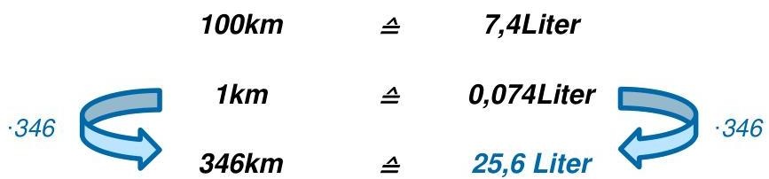

> **Bildbeschreibung:**
> Das Bild zeigt eine einfache Berechnung zur Umrechnung von Benzinverbrauch in Abhängigkeit von der zurückgelegten Strecke.
> 
> 1. **Hauptinformationen:**
>    - **100 Kilometer:** Entsprechen einem Benzinverbrauch von **7,4 Litern**.
>    - **1 Kilometer:** Entspricht einem Benzinverbrauch von **0,074 Litern** (berechnet durch Division von 7,4 Litern durch 100).
> 
> 2. **Anwendung auf eine spezifische Strecke:**
>    - **346 Kilometer:** Entsprechen einem Benzinverbrauch von **25,6 Litern** (berechnet durch Multiplikation von 0,074 Litern pro Kilometer mit 346 Kilometern).
> 
> 3. **Visualisierung:**
>    - Die Zahlen und die Umrechnung sind durch Pfeile und Kreise visualisiert, die die Beziehung zwischen den Kilometern und Litern verdeutlichen.
>    - Die Pfeile zeigen die Richtung der Berechnung an, von der Strecke zu den Litern und umgekehrt.
> 
> Das Bild dient also als eine visuelle Anleitung, um den Benzinverbrauch für eine bestimmte Strecke zu berechnen.

Es handelt sich um einen proportionalen Zusammenhang, da jeder gefahrene Kilometer auch die verbrauchten Liter erhöht. (Je mehr km gefahren werden, desto mehr Benzin wird verbraucht.)

Skript MAPH 1. Sem. PR-GF Lehrer, V1.0

MT

---

[Seite: 19]

BBW Berufsbildungsschule Winterthur Abteilung Maschinenbau

# 3.2 Umgekehrt proportionaler Zusammenhang

Es gibt aber auch den umgekehrten Fall. Man spricht dann von einem umgekehrt proportionalen Zusammenhang. Auch diesen Fall erklärt man am besten mit einem konkreten Beispiel:

Drei Maurer benötigen für das Fertigstellen einer Hauswand 7 Tage. Wie lange hätten 5 Maurer für die gleiche Arbeit?

3 Maurer  $\triangleq$  7 Tage

5 Maurer  $\triangleq$  x Tage

In diesem Fall dauert es ja weniger lang, je mehr Arbeiter zur Verfügung stehen. Auch in diesem Fall berechnen wir zuerst, wie lange 1 Maurer für die Arbeit hätte.

> **Bildbeschreibung:**
> Das Bild zeigt eine grafische Darstellung zur Berechnung von Zeitintervallen basierend auf der Anzahl der "Maurer".
> 
> Auf der linken Seite des Bildes sind zwei Pfeile zu sehen, die jeweils mit einer Zahl versehen sind: Der obere Pfeil ist mit "3" markiert, der untere mit "1".
> 
> Auf der rechten Seite des Bildes sind zwei Zeitangaben zu sehen: "7 Tage" und "21 Tage".
> 
> Die Pfeile und die Zeitangaben sind durch eine Gleichheitsrelation verbunden, die durch das Symbol "≡" dargestellt wird.
> 
> Die Interpretation dieser Grafik ist wie folgt:
> - Wenn 3 Maurer 7 Tage benötigen, dann entspricht dies der Arbeitsleistung von 1 Maurer für 21 Tage.
> - Dies deutet auf eine proportionale Beziehung zwischen der Anzahl der Maurer und der benötigten Zeit hin, wobei mehr Maurer weniger Zeit benötigen und umgekehrt.

Während links mit 3 dividiert wird, muss rechts mit 3 multipliziert werden. Das Verhältnis ist ja umgekehrt proportional.

Im zweiten Schritt multiplizieren wir links mit 5, während rechts mit 5 dividiert wird.

3 Maurer  $\triangleq$  7 Tage

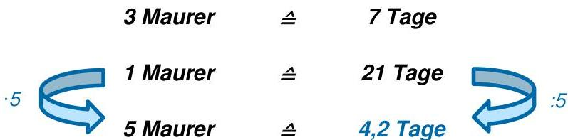

> **Bildbeschreibung:**
> Das Bild zeigt eine einfache, aber informative Grafik, die den Zusammenhang zwischen der Anzahl der Maurer und der Dauer eines Bauprojekts in Tagen darstellt.
> 
> 1. **Hauptaussage:**
>    - Die Grafik veranschaulicht, wie sich die Anzahl der Maurer auf die Dauer eines Bauprojekts auswirkt.
> 
> 2. **Dargestellte Daten:**
>    - **3 Maurer:** Entsprechen einer Dauer von 7 Tagen.
>    - **1 Maurer:** Entspricht einer Dauer von 21 Tagen.
>    - **5 Maurer:** Entsprechen einer Dauer von 4,2 Tagen.
> 
> 3. **Visualisierung:**
>    - Die Grafik zeigt drei Pfeile, die jeweils eine bestimmte Anzahl von Maurern mit der dazugehörigen Dauer in Tagen verbinden.
>    - Die Pfeile sind mit den Zahlen 3, 1 und 5 beschriftet, was die Anzahl der Maurer angibt.
>    - Die Pfeile zeigen auf die Tageangaben 7, 21 und 4,2, die die Dauer des Projekts bei der jeweiligen Anzahl von Maurern darstellen.
> 
> 4. **Kontext:**
>    - Die Grafik scheint zu verdeutlichen, dass mehr Maurer die Bauzeit verkürzen. Zum Beispiel dauert das Projekt mit 5 Maurern nur 4,2 Tage, während es mit nur 1 Maurer 21 Tage dauert.
> 
> 5. **Zusammen

Bevor Sie mit dem Lösen einer Aufgabe starten, müssen Sie überlegen, ob es sich um einen proportionalen, oder einen umgekehrt proportionalen Fall handelt.

Skript MAPH 1. Sem. PR-GF Lehrer, V1.0

MT

18/37

---

[Seite: 20]

BBW Berufsbildungsschule Winterthur Abteilung Maschinenbau

# 3.3 Übungsaufgaben Dreisatz

Lösen Sie folgende Aufgaben auf einem separaten Blatt.

1. Eine Plakatwerbung kostet für 60 Tage 546,00sFr. Wieviel muss für 76 Tage gezahlt werden? 691,6sFr
2. Eine Firma hat 13 Geschäftsfahrzeuge. Diese verbrauchen monatlich 1560 Liter Benzin. Es werden zwei weitere Autos gekauft. Wie hoch ist jetzt der monatliche Benzinverbrauch? 1800l
3. Für das Eindecken eines Daches von 408m² werden 10'200 Platten benötigt. Wie viele Platten benötigt ein 381m² großes Dach? 9525
4. Aus drei je 50kg schweren Rohlingen werden drei Fertigteile mit einem Gesamtgewicht von 129,9kg gedreht. Wie hoch ist das Gewicht der Späne nach einer Tagesproduktion von 25 Werkstücken? 167,5kg
5. Die betrieblichen Stromkosten betragen 5'763,15sFr für 19'210kWh. Wie hoch ist der Stromkostenanteil des Materiallagers? (alter Zählerstand 6'937 kWh, neuer Stand 9'023 kWh) 625,8sFr
6. Eine Treppe hat 24 Stufen mit einer Steighöhe von jeweils 18cm. Wie viele Stufen mit einer Steighöhe von 16cm hat eine gleich große Treppe? 27 Stufen
7. 14 Abfüllautomaten haben eine Tageskapazität von 2'100 Flaschen. Wie viele Automaten müssen nachbestellt werden, damit 3'000 Flaschen abgefüllt werden können? 6 Automaten
8. Ein Frachter benötigt für eine Fahrt bei 17 Knoten Geschwindigkeit 10 Tage und 18 Stunden. Wie lange benötigt der Frachter bei 20 Knoten? 9 Tage 3 Stunden 18 Minuten
9. Eine Wärmepumpe verbraucht in 4½ Stunden 174kWh Strom. Wie viele kWh Strom verbraucht die Wärmepumpe in 15¼ Stunden? 589,67kWh
10. Eine Batterie liefert 21 Glühlampen für 75 Stunden Strom. Es werden vier weitere Lampen an das Batterienetz angeschlossen. Für welche Zeit reicht bei dieser Belastung die Batterieladung? 65,625h
11. Der Vorrat einer Ware reicht noch 36 Tage bei einem Tagesumsatz von 350kg. Wie viele Tage reicht der gleiche Vorrat bei 280kg Tagesumsatz? 45 Tage
12. Ein Rohstoffvorrat reicht für 35 Maschinen 24 Arbeitstage. Für wie viele Arbeitstage reicht der Vorrat, wenn 7 Maschinen ausfallen? 30 Tage
13. Das Ausheben einer Grube (8m lang, 3,5m breit, 2m tief) kostet 1'252 sFr. Wieviel kostet das Ausheben einer Grube mit den Massen 4,5m • 2m • 3m? 603,64sFr
14. Ein 6m² großes Kupferblech, 4mm dick, wiegt 213,6 kg. Wie viel wiegt ein 3mm dickes Kupferblech, das eine Fläche von 4m² hat? 106,8kg
15.* Um 1280 Karosserieteile herzustellen, muss man 4 Stanzen 8h lang einsetzen. Um wie viel Stunden muss man die tägliche Arbeitszeit erhöhen, wenn 2400 Karosserieteile täglich hergestellt werden sollen und zwei Stanzen zusätzlich eingesetzt werden können? 2 Stunden

Skript MAPH 1. Sem. PR-GF Lehrer, V1.0
MT
19/37

---

[Seite: 21]

BBW Berufsbildungsschule Winterthur Abteilung Maschinenbau

16.* Auf drei automatischen Werkzeugmaschinen kann man 150 Metallhülsen in 1h15min herstellen. Wie viele Hülsen könnten in 2h30min hergestellt werden, wenn man zwei Maschinen zusätzlich einsetzt?
500 Hülsen

17. Ein Schwimmbecken wird von 4 Pumpen in 12 Stunden befüllt. Wie lange brauchen dafür 3 Pumpen?
16 Stunden

18. 5 Häcksler benötigen für das gelieferte Hackgut 55 Stunden. Wie lange benötigen hierfür 11 Häcksler?
25 Stunden

19. 300 Liter Brennöl reichen für 20 Lampen, die an 25 Tagen jeweils 6 Stunden täglich brennen. Wieviel Öl benötigen 18 Lampen, die an 30 Tagen jeweils 5 Stunden brennen?
270 Liter

20.* 25 Arbeiter stellen in 32 Tagen bei täglich 7 Stunden ein Sportfeld von 8'000m² fertig. In wie vielen Tagen a 8 Stunden schaffen 20 Arbeiter ein 12'000 m²-Feld?
52,5 Tage

21.* Einen Bau erledigen 3 Arbeiter in 10 Tagen in täglich 8 Stunden Arbeit.

a) Wie viele Arbeitskräfte müssten hinzugezogen werden, um den Umbau in sechs Tagen bei unveränderter täglicher Arbeitszeit durchzuführen? 2 Arbeiter
b) Wie viele Überstunden müssen täglich gemacht werden, wenn keine weiteren Arbeiter hinzukommen, der Umbau jedoch in 6 Tagen fertig sein soll? 5,3h
c) Auf wieviel Stunden muss die tägliche Arbeitszeit heraufgesetzt werden, um den Umbau in sechs Tagen durchzuführen, wenn noch ein Arbeiter hinzukommt? 2h

22. Ein Verkäufer erhält bei einem monatlichen Umsatz von 45'200sFr eine Provision von 3'164sFr. Im nächsten Monat erhöht sich seine Provision um 220,50sFr. Wie hoch war der Umsatz?
48'350sFr

23. 19 Betriebe planen eine gemeinsame Werbeaktion. Jeder Betrieb beteiligt sich mit 5'200sFr. Um wie viele sFr sinken die Kosten pro Betrieb, wenn sich fünf weitere Betriebe an der Werbeaktion beteiligen?
1'083sFr

24. Ein 168m³-Tank wird durch zwei Zuleitungen gefüllt, die 180 und 240 Liter pro Minute liefern. Wie lange dauert das Befüllen, wenn beide Leitungen in Betrieb sind?
400 Runden

Skript MAPH 1. Sem. PR-GF Lehrer, V1.0
MT
20/37

---

[Seite: 22]

图

BBW Berufsbildungsschule Winterthur Abteilung Maschinenbau

# 4 Physikalische Grundlagen

## LERNZIELE:

- Sie kennen den Unterschied zwischen einem Formelzeichen und einer Einheit
- Sie kennen die wichtigsten physikalischen Einheiten, speziell die SI-Basiseinheiten
- Sie kennen die Einheitsvorsätze, deren Potenzschreibweise und können damit rechnen
- Sie sind in der Lage, physikalische Einheiten umzurechnen

Physik ist eine faszinierende Grundlagenwissenschaft, die sich damit befasst, Phänomene der Natur zu erforschen und daraus allgemein gültige Regeln (Naturgesetze) zu entwickeln.

## Teilgebiete der Physik

Die Physik wird in verschiedene Teilgebiete unterteilt. Einige davon werden Sie im Laufe Ihrer Lehre kennenlernen.

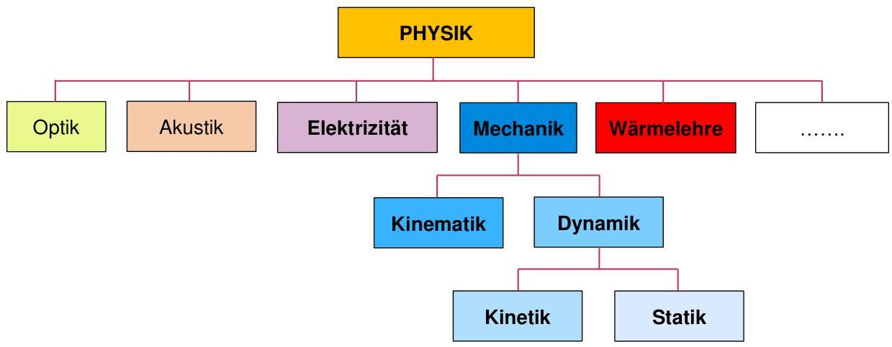

> **Bildbeschreibung:**
> Das Bild ist eine hierarchische Darstellung der verschiedenen Teilgebiete der Physik. Hier ist eine detaillierte Beschreibung:
> 
> 1. **Hauptkategorie:**
>    - **PHYSIK** steht an der Spitze der Hierarchie und ist in einem gelben Kasten dargestellt.
> 
> 2. **Unterkategorien der Physik:**
>    - Die Hauptkategorie "PHYSIK" verzweigt sich in fünf Hauptunterkategorien, die jeweils in eigenen Kästen dargestellt sind:
>      - **Optik** (grüner Kasten)
>      - **Akustik** (brauner Kasten)
>      - **Elektrizität** (lila Kasten)
>      - **Mechanik** (blauer Kasten)
>      - **Wärmelehre** (roter Kasten)
>      - Ein weiterer leerer Kasten deutet darauf hin, dass es noch weitere Teilgebiete der Physik gibt, die hier nicht spezifiziert sind.
> 
> 3. **Weitergehende Unterteilung der Mechanik:**
>    - Die Mechanik wird weiter in zwei Unterkategorien unterteilt:
>      - **Kinematik** (hellblauer Kasten)
>      - **Dynamik** (hellblauer Kasten)
> 
> 4. **Weitergehende Unterteilung der Dynamik:**
>    - Die Dynamik wird noch einmal in zwei spezifischere Teilgebiete unterteilt:
>      - **Kinetik** (hellgrauer Kasten)
> 

## Unterschied zwischen Physik und Chemie

> **Bildbeschreibung:**
> Das Bild zeigt eine einfache, aber prägnante Illustration eines Lagerfeuers.
> 
> Im Zentrum des Bildes brennt ein Feuer, das aus mehreren Flammen besteht. Die Flammen sind in verschiedenen Schattierungen von Orange und Rot dargestellt, was die Hitze und das lebendige Wesen des Feuers unterstreicht. Die Flammen sind unregelmäßig geformt und scheinen sich nach oben auszubreiten, was typisch für ein Feuer ist.
> 
> Unter den Flammen befindet sich ein Holzscheit, das als Brennmaterial dient. Das Holz ist in einem natürlichen Braunton gezeichnet und wirkt wie ein klassisches Stück Feuerholz.
> 
> Das Bild ist in einem flachen, zweidimensionalen Stil gehalten, ohne Tiefe oder Schatten, was es zu einer klaren und leicht verständlichen Darstellung macht. Es gibt keinen sichtbaren Text oder weitere Elemente im Bild.
> 
> Der Kontext könnte ein Lagerfeuer in einer natürlichen Umgebung sein, wie zum Beispiel in einem Wald oder auf einer Wiese, wo Menschen sich versammeln, um gemeinsam zu sitzen, zu essen und zu plaudern. Das Feuer dient dabei als Wärmequelle und als Mittelpunkt der Gemeinschaft.

Chemie

Bei einem chemischen Vorgang entsteht ein neuer Stoff mit neuen Eigenschaften.

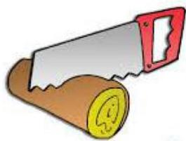

> **Bildbeschreibung:**
> Das Bild zeigt eine Illustration eines Sägeblatts, das sich in einem aktiven Zustand befindet. Das Sägeblatt ist in zwei Farben unterteilt: Der obere Teil ist grau, während der untere Teil rot ist. Das Sägeblatt hat eine gezackte Klinge, die typisch für Sägeblätter ist.
> 
> Unter dem Sägeblatt befindet sich ein Holzstab, der in zwei Farben gehalten ist: Der obere Teil des Stabes ist braun, während der untere Teil gelb ist. Der gelbe Teil des Stabes hat eine runde Form und ist mit einem kleinen, gelben Kreis markiert, der ein "Q" enthält.
> 
> Das Sägeblatt scheint gerade dabei zu sein, den Holzstab zu durchtrennen. Die Illustration gibt den Eindruck von Bewegung und Arbeit wieder, da das Sägeblatt aktiv in das Holz eindringt. Es gibt keinen weiteren Kontext oder Text im Bild.

Physik

Bei einem physikalischen Vorgang ergibt sich nur eine Zustandsänderung. Entweder ändert sich der Aggregatszustand und/oder die Form. Die Stoffeigenschaften bleiben erhalten.

Skript MAPH 1. Sem. PR-GF Lehrer, V1.0

MT

---

[Seite: 23]

BBW Berufsbildungsschule Winterthur Abteilung Maschinenbau

# 4.1 Rechnen mit physikalischen Größen und Einheiten

Jede physikalische Angabe besteht aus einem Formelzeichen (Länge: l), einer Mengenangabe (Zahl) und einer physikalischen Einheit (Meter: m).

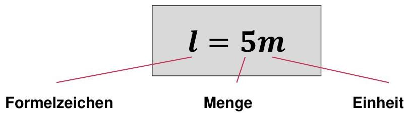

> **Bildbeschreibung:**
> Das Bild zeigt eine schematische Darstellung einer physikalischen Größe mit den dazugehörigen Beschriftungen.
> 
> 1. **Formelzeichen**: Links im Bild ist das Wort "Formelzeichen" zu sehen. Dies bezieht sich auf das Symbol, das in der Mathematik und Physik verwendet wird, um eine bestimmte Größe darzustellen.
> 
> 2. **Menge**: In der Mitte des Bildes befindet sich ein grauer Rechteckblock, in dem die Zahl "5" und das Symbol "m" (für Meter) zu sehen sind. Dies steht für die Menge der Länge, die hier als 5 Meter angegeben ist.
> 
> 3. **Einheit**: Rechts im Bild steht das Wort "Einheit". Dies bezieht sich auf die Maßeinheit, in der die Größe gemessen wird. In diesem Fall ist die Einheit Meter (m).
> 
> Das Bild verdeutlicht also, dass das Formelzeichen für die Länge "l" ist, die Menge der Länge 5 Meter beträgt und die Einheit Meter ist.

# 4.1.1 Formelzeichen

Formelzeichen bestehen grundsätzlich aus einem Buchstaben, wobei diese gross oder klein sein können. Sie sind meist vom englischen oder lateinischen Begriff abgeleitet (F steht für Kraft und ist vom englischen Begriff force abgeleitet). Zur klareren Kennzeichnung werden oft noch Indizes eingesetzt, deren Verwendung oft nicht so genau geregelt ist. Bsp: $F_{1}, F_{2}, F_{A}, F_{B}$

Notieren Sie nachfolgend 11 weitere Formelzeichen, die Sie aus Ihrer Schulzeit schon kennen:

|  l (Länge) | V (Volumen) | v (Geschwindigkeit) | t (Zeit)  |
| --- | --- | --- | --- |
|  T (Temperatur) | b (Breite) | s (Strecke, Weg) | α (Winkel)  |
|  μ (Reibzahl) | m (Masse, Gewicht) | r (Radius) | P (Leistung)  |

Eine Übersicht dazu finden Sie in Ihrem Buch „Formeln und Tabellen“ im Kapitel 6.

# 4.1.2 Einheiten

Speziell in der Physik, aber auch in Teilgebieten der Mathematik, wird nicht nur mit Zahlen, sondern auch mit Einheiten gerechnet. Da nicht alle Einheiten einfach problemlos miteinander verrechnen werden können, sorgt man mit den sogenannten SI-Einheiten für Ordnung.

Viele Einheiten wurden ursprünglich von menschlichen Eigenschaften oder markanten Naturphänomenen abgeleitet:

- die Sekunde = Periodendauer des Herzschlags
- der Zoll = Daumenbreite
- $0^{\circ}C$ = Gefrierpunkt des Wassers
- der Meter = 10-millionstel Teil eines Erdquadranten
- das Kilogramm = Masse von 1-Tausendstel Kubikmeter Wasser

Viele werden heute noch verwendet, nur hat man ihre Definition verändert, da man merkte, dass z.B. nicht jeder Herzschlag gleich lang und nicht jeder Daumen gleich breit ist. So gilt z.B.:

- die Sekunde = das 9'192'631'770 fache der Periodendauer der Strahlung von Atomen des Nuklids $^{133}\mathrm{Cs}$
- der Meter = Länge der Strecke, die das Licht im Vakuum in 1/299'792'458 Sekunden durchläuft

Skript MAPH 1. Sem. PR-GF Lehrer, V1.0

MT

---

[Seite: 24]

BBW Berufsbildungsschule Winterthur
Abteilung Maschinenbau

# SI- Einheiten

Da in der Physik auch eine Länge mit einer Zeiteinheit verrechnet werden kann, ist es wichtig, dass die richtigen Einheiten gewählt werden. Im SI-System (Système International d'Unités) bilden 7 Basiseinheiten die Grundlage für den Aufbau aller anderen physikalischen Größen.

## SI-Basiseinheiten

|  Grösse | Formelz. | Einheit  |   |
| --- | --- | --- | --- |
|  Länge | l | m | Meter  |
|  Masse | m | kg | Kilogramm  |
|  Zeit | t | s | Sekunde  |
|  El. Stromstärke | l | A | Ampere  |
|  Temperatur | T | K | Kelvin  |
|  Stoffmenge | n | mol | Mol  |
|  Lichtstärke | l_{v} | cd | Candela  |

## Bsp. von abgeleitete SI-Einheiten

|  Grösse | Formelz. | Einheit  |   |
| --- | --- | --- | --- |
|  Kraft | F | N (kg·m/s²) | Newton  |
|  Geschw. | v | m/s |   |
|  Druck | p | Pa (N/m²) | Pascal  |
|  Arbeit | W | Nm | Newtonmeter  |
|  Leistung | P | W (Nm/s) | Watt  |
|  |   |   |   |
|  |   |   |   |

Nicht zum SI-System zählen Einheiten wie: bar, Grad Celsius, PS, usw.

Eine Übersicht finden Sie in den meisten Formelsammlungen.

Grundsätzlich könnten alle anderen Einheiten auf diese 7 Basiseinheiten zurückgeführt werden.

Bsp: Die physikalische Einheit für die Geschwindigkeit $v$ ist $\frac{m}{s}$. Sie wird also aus einer Länge (m) und einer Zeit (s) „zusammengebaut“.

Bestimmten Kombinationen, die für häufig verwendete physikalische Größen gebraucht werden, hat man eigene Namen gegeben. Zum Beispiel für die Kraft: $1\frac{kg \cdot m}{s^2} = 1 \cdot N$ (Newton)

## 4.1.2 Einheitsvorsätze

Die Physik beschäftigt sich mit sehr kleinen Dingen wie z.B. den Atomen, aber auch mit sehr grossen Sachen wie z.B. den Abständen von Planeten. Würde man sowohl in der Atom- als auch der Astrophysik für die Länge die Grundeinheit Meter einsetzen, so ergäben sich im einen Fall extrem kleine und im anderen Fall extrem grosse Zahlen.

Aus diesem Grund hat man im SI-System die sogenannten Einheitsvorsätze eingeführt.

Beispiele:

$$
1'000m = 1\,km
$$

$$
\frac{1}{1000} m = 1\,mm
$$

$$
1'000'000W = 1\,MW
$$

$$
\frac{1}{10} l = 1\,dl
$$

Skript MAPH 1. Sem. PR-GF Lehrer, V1.0
MT
23/37

---

[Seite: 25]

BBW Berufsbildungsschule Winterthur Abteilung Maschinenbau

Versuchen Sie in der nachfolgenden Tabelle, die leeren Felder auszufüllen.

|  Faktor | Benennung | Potenzschreibweise | Vorsatz-Zeichen | Vorsatz-Benennung  |
| --- | --- | --- | --- | --- |
|  1'000'000'000'000'000'000 | Trillion | 10^{18} | E | Exa  |
|  1'000'000'000'000'000 | Billiarde | 10^{15} | P | Peta  |
|  1'000'000'000'000 | Billion | 10^{12} | T | Tera  |
|  1'000'000'000 | Milliarde | 10^{9} | G | Giga  |
|  1'000'000 | Million | 10^{6} | M | Mega  |
|  1'000 | Tausend | 10^{3} | k | Kilo  |
|  100 | Hundert | 10^{2} | h | Hekto  |
|  10 | Zehn | 10^{1} | da | Deka  |
|  1 | Eins | 10^{0} | – – | – –  |
|  0,1 | Zehntel | 10^{-1} | d | Dezi  |
|  0,01 | Hundertstel | 10^{-2} | c | Centi  |
|  0,001 | Tausendstel | 10^{-3} | m | Milli  |
|  0,000'001 | Millionstel | 10^{-6} | μ | Mikro  |
|  0,000'000'001 | Milliardstel | 10^{-9} | n | Nano  |
|  0,000'000'000'001 | Billionstel | 10^{-12} | p | Pico  |
|  0,000'000'000'000'001 | Billiardstel | 10^{-15} | f | Femto  |
|  0,000'000'000'000'000'001 | Trillionstel | 10^{-18} | a | Atto  |

**Zusatzmaterial:**
- Internationales Einheitssystem
- Video 10 hoch 10

Skript MAPH 1. Sem. PR-GF Lehrer, V1.0
MT
24/37

---

[Seite: 26]

BBW Berufsbildungsschule Winterthur
Abteilung Maschinenbau

# 4.1.3 Übungsaufgaben: Rechnen mit physikalischen Einheiten

1. Schreiben Sie die folgenden Angaben in physikalischer Kurzform. Sollten Sie Formelzeichen oder Einheiten nicht kennen, so nehmen Sie Ihr Buch „Formeln und Tabellen“ zur Hilfe.

a) Länge 0,4 Meter  $l = 0,4m$
b) Masse 76 Kilogramm  $m = 76kg$
c) Zeit 25 Sekunden  $t = 25s$
d) Stromstärke 0,2 Ampere  $I = 0,2A$
e) Stoffmenge 90 Mol  $n = 90mol$
f) Temperatur 117 Kelvin  $T = 117K$

g) Kraft 12 Newton  $F = 12N$
h) Geschw. 12 Meter pro Sekunde  $v = 12^{m/s}$
i) Volumen 3 Kubikmeter  $V = 3m^3$
j) Druck 120 Pascal  $p = 120Pa$
k) Drehmoment 24 Newtonmeter  $M = 24Nm$
l) Leistung 85 Kilowatt  $P = 85kW$

2. Schreiben Sie die folgenden Werte ohne Einheitsvorsätze.

a)  $32mm =$  0,032m
b)  $697hl =$  69'700l
c)  $12M\Omega =$  12'000'000Ω
d)  $133cl =$  1,33l
e)  $84daN =$  840N
f)  $15\mu m =$  0,000'015m

g)  $765kV =$  765'000V
h)  $0,7ms =$  0,0007s
i)  $462\mu g =$  0,000'462g
j)  $65nF =$  0,000'000'065F
k)  $43GV =$  43'000'000'000V
l)  $0,33dl =$  0,033l

3. Wandeln Sie die folgenden Werte in die gewünschte Einheit um.

a)  $28'720mm =$  28,72 m
b)  $0,0035s =$  3,5 ms
c)  $415\mu A =$  0,415 mA
d)  $56\mu m =$  0,000056 m
e)  $6,025km =$  6'025 m
f)  $325ms =$  0,325 s

g)  $45'000kg =$  45 Mg (t)
h)  $25\mu m =$  0,025 mm
i)  $30'000\mu s =$  0,03 s
j)  $12nm =$  0,012 $\mu m$
k)  $1'800ps =$  1,8 ns
l)  $0,0005Mm =$  500 m

4. Schreiben Sie die folgenden Werte mit einem zweckmäßigen Einheitsvorsatz.

a)  $12'525m =$  12,525km
b)  $3'590mg =$  3,59g
c)  $0,0064mm =$  6,4μm
d)  $500'000V =$  500kV
e)  $0,0377GV =$  37,7MV
f)  $8'340daN =$  83,4kN

g)  $45'760g =$  45,76kg
h)  $8'750nF =$  8,75μF
i)  $18'600M\Omega =$  18,6GΩ
j)  $0,045s =$  45ms
k)  $6'367'000W =$  6,367MW
l)  $13'300l =$  133hl

Skript MAPH 1. Sem. PR-GF Lehrer, V1.0
MT
25/37

---

[Seite: 27]

BBW Berufsbildungsschule Winterthur
Abteilung Maschinenbau

5. Ersetzen Sie die Einheitsvorsätze durch Zehnerpotenzen.

a) $35\,\mathrm{mm} = \quad 35 \cdot 10^{-3} \, \mathrm{m}$
b) $12\,\mathrm{kg} = \quad 12 \cdot 10^{3} \, \mathrm{g}$
c) $14,2\,\mu\mathrm{A} = \quad 14,2 \cdot 10^{-6} \, \mathrm{A}$
d) $22\,\mathrm{nm} = \quad 22 \cdot 10^{-9} \, \mathrm{m}$
e) $7,5\,\mathrm{km} = \quad 7,5 \cdot 10^{3} \, \mathrm{m}$
f) $618\,\mathrm{ms} = \quad 618 \cdot 10^{-3} \, \mathrm{s}$

g) $18\,\mathrm{Mg} = \quad 18 \cdot 10^{6} \, \mathrm{g}$
h) $75\,\mu\mathrm{m} = \quad 75 \cdot 10^{-6} \, \mathrm{m}$
i) $80\,\mathrm{cm} = \quad 80 \cdot 10^{-2} \, \mathrm{m}$
j) $45\,\mathrm{nm} = \quad 45 \cdot 10^{-9} \, \mathrm{m}$
k) $2,5\,\mathrm{ps} = \quad 2,5 \cdot 10^{-12} \, \mathrm{s}$
l) $0,04\,\mathrm{MN} = \quad 0,04 \cdot 10^{6} \, \mathrm{N}$

6. Ersetzen Sie die Zehnerpotenzen durch Einheitsvorsätze.

a) $36 \cdot 10^{3} \, \mathrm{m} = \quad 36\,\mathrm{km}$
b) $1,8 \cdot 10^{3} \, \mathrm{g} = \quad 1,8\,\mathrm{kg}$
c) $1,7 \cdot 10^{-6} \, \mathrm{A} = \quad 1,7\,\mu\mathrm{A}$
d) $5 \cdot 10^{6} \, \mathrm{m} = \quad 5\,\mathrm{Mm}$
e) $0,2 \cdot 10^{3} \, \mathrm{s} = \quad 0,2\,\mathrm{ks}$
f) $6,8 \cdot 10^{-9} \, \mathrm{F} = \quad 6,8\,\mathrm{nF}$

g) $5,4 \cdot 10^{-2} \, \mathrm{m} = \quad 5,4\,\mathrm{cm}$
h) $14 \cdot 10^{-1} \, \mathrm{m} = \quad 14\,\mathrm{dm}$
i) $0,2 \cdot 10^{-6} \, \mathrm{m} = \quad 0,2\,\mu\mathrm{m}$
j) $3,9 \cdot 10^{2} \, \mathrm{s} = \quad 3,9\,\mathrm{hs}$
k) $12 \cdot 10^{12} \, \mathrm{W} = \quad 12\,\mathrm{TW}$
l) $1,3 \cdot 10^{6} \, \mathrm{A} = \quad 1,3\,\mathrm{MA}$

7. Rechnen Sie die kombinierten Einheiten um.

a) $8\,\mathrm{cm/s} = \quad 0,08 \, \mathrm{m/s}$
b) $3'000 \, \mathrm{m/s} = \quad 3 \, \mathrm{km/s}$
c) $4,2\,\mathrm{kg/dm^3} = \quad 4'200 \, \mathrm{g/dm^3}$
d) $4'200 \, \mathrm{g/dm^3} = \quad 4,2 \, \mathrm{g/cm^2}$

e) $12\,\mathrm{m/s} = \quad 43,2 \, \mathrm{km/h}$
f) $25\,\mathrm{N/cm^2} = \quad 250'000 \, \mathrm{N/m^2}$
g) $37\,\mathrm{m/s} = \quad 2'220 \, \mathrm{m/min}$
h) $72\,\mathrm{km/h} = \quad 20 \, \mathrm{m/s}$

8. Berechnen Sie:

a) $5\,\mathrm{km} + 0,3\,\mathrm{km} - 200 \, \mathrm{m} = \quad 5,1 \, \mathrm{km}$
b) $500\,\mu\mathrm{A} - 0,3\,\mathrm{mA} + 0,001 \, \mathrm{A} = \quad 1,2 \, \mathrm{mA}$
c) $35\,\mathrm{s} + 0,2 \cdot 10^{3} \, \mathrm{s} - 0,1\,\mathrm{ks} = \quad 135 \, \mathrm{s}$
d) $10\,\mathrm{N} + 0,1\,\mathrm{kN} + 0,1 \cdot 10^{4} \, \mathrm{N} = \quad 1,11 \, \mathrm{kN}$
e) $8 \cdot 0,003 \, \mathrm{V} - 23 \, \mathrm{mV} = \quad 1 \, \mathrm{mV}$
f) $7 \cdot 3\,\mu\mathrm{m} + 0,008 \cdot 6 \, \mathrm{mm} = \quad 69 \, \mu\mathrm{m}$
g) $(6\,\mathrm{MJ} + 400 \, \mathrm{kJ}) : 800 \, \mathrm{kJ} = \quad 8$
h) $3 \cdot 10^{-6} \, \mathrm{m} \cdot 5 \cdot 10^{3} \, \mathrm{m} = \quad 0,015 \, \mathrm{m^2}$

Skript MAPH 1. Sem. PR-GF Lehrer, V1.0
MT
26/37

---

[Seite: 28]

BBW Berufsbildungsschule Winterthur Abteilung Maschinenbau

# 5 Gleichförmige Bewegung

**LERNZIELE:**
- Sie können gradlinige und kreisförmige Bewegung unterscheiden und berechnen
- Sie kennen die verschiedenen Einheiten und können zwischen ihnen umrechnen
- Sie können den Begriff Umfangsgeschwindigkeit erklären und anwenden
- Sie können s-t- und v-t-Diagramme interpretieren

Von einer gleichförmigen Bewegung spricht man, wenn sich die Geschwindigkeit, z.B. eines Fahrzeugs, während der gemessenen Zeit nicht ändert. Sie bleibt immer gleich. Eine gleichförmige Bewegung kann gradlinig, oder kreisförmig sein.

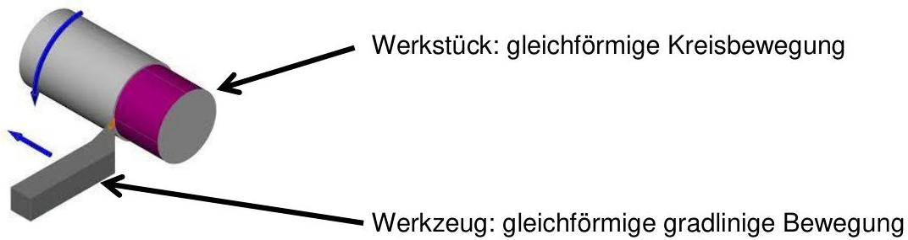

> **Bildbeschreibung:**
> Das Bild zeigt eine technische Darstellung eines Bearbeitungsprozesses in der Metallverarbeitung.
> 
> 1. **Werkstück (Werkstück: gleichförmige Kreisbewegung)**:
>    - Das Werkstück ist ein zylindrischer Körper, der sich in gleichförmiger Kreisbewegung bewegt. Diese Bewegung wird durch den blauen Pfeil angedeutet, der sich um den Zylinder herum bewegt.
> 
> 2. **Werkzeug (Werkzeug: gleichförmige gradlinige Bewegung)**:
>    - Das Werkzeug ist ein rechteckiger Körper, der sich in gleichförmiger gradliniger Bewegung bewegt. Diese Bewegung wird durch den blauen Pfeil dargestellt, der horizontal auf das Werkstück gerichtet ist.
> 
> 3. **Zusammenarbeit der Bewegungen**:
>    - Die Kombination aus der Kreisbewegung des Werkstücks und der gradlinigen Bewegung des Werkzeugs ermöglicht eine präzise Bearbeitung des zylindrischen Werkstücks. Dies könnte ein Dreh- oder Fräsprozess sein, bei dem das Werkzeug Material vom rotierenden Werkstück abträgt.
> 
> Der Text im Bild gibt die Bewegungsarten der beiden Komponenten an und verdeutlicht somit den Prozess der Materialbearbeitung.

# 5.1 Gleichförmige gradlinige Bewegung

Zur Erfassung einer gleichförmigen, gradlinigen Geschwindigkeit benötigt man eine Uhr zur Zeitmessung (t) und einen Massstab zur Messung der Wegstrecke (s).

Bewegt sich das Fahrzeug **gleichförmig**, so werden wir feststellen, dass für die gleichen Wegstrecken immer gleich viel Zeit benötigt wird. Als Beispiel sehen Sie in der rechten Tabelle die Messwerte von zwei unterschiedlich schnellen Fahrzeugen (Fahrzeug a und Fahrzeug b).

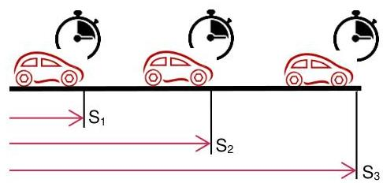

> **Bildbeschreibung:**
> Das Bild zeigt eine schematische Darstellung von drei Autos, die sich auf einer Straße befinden und jeweils mit einer Stoppuhr assoziiert sind.
> 
> 1. **Autos und Stoppuhren:**
>    - Jedes der drei Autos ist rot und befindet sich auf einer schwarzen Straße.
>    - Über jedem Auto ist eine Stoppuhr abgebildet, die symbolisch für die Zeitmessung steht.
> 
> 2. **Abstände und Beschriftungen:**
>    - Die Autos sind in einer Reihe angeordnet und durch horizontale Abstände voneinander getrennt.
>    - Unterhalb der Straße sind drei Pfeile eingezeichnet, die mit \( S_1 \), \( S_2 \) und \( S_3 \) beschriftet sind.
>    - \( S_1 \) zeigt den Abstand zwischen dem ersten und dem zweiten Auto.
>    - \( S_2 \) zeigt den Abstand zwischen dem zweiten und dem dritten Auto.
>    - \( S_3 \) zeigt den gesamten Abstand von dem ersten bis zum dritten Auto.
> 
> 3. **Kontext:**
>    - Die Stoppuhren über den Autos deuten darauf hin, dass es um die Zeitmessung der zurückgelegten Strecken oder der Zeitintervalle zwischen den Autos geht.
>    - Die Beschriftungen \( S_1 \), \( S_2 \), und \( S_3 \) könnten die verschiedenen Streckenabschnitte oder Zeitintervalle zwischen den Autos darstellen.
> 
> Das Bild scheint also eine Darstellung zur Erklärung von Zeit

|  Distanz [m] | Zeit a [s] | Zeit b [s]  |
| --- | --- | --- |
|  2 | 1,5 | 3  |
|  4 | 3 | 6  |
|  6 | 4,5 | 9  |

Die Geschwindigkeit, resp. das Verhältnis von Weg und Zeit, lässt sich am besten in einem Diagramm veranschaulichen. Auf der senkrechten Achse wird der Weg eingetragen und auf der horizontalen die Zeit. Man spricht daher von einem:

**WEG-ZEIT-DIAGRAMM**

**Aufgabe:**
Übertragen Sie die obigen Tabellenwerte ins nebenstehende Diagramm.

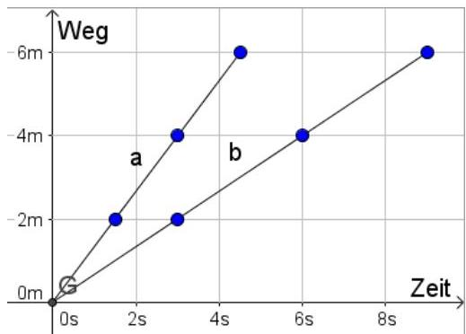

> **Bildbeschreibung:**
> Das Bild zeigt ein Weg-Zeit-Diagramm, das die Bewegung zweier Objekte über die Zeit darstellt.
> 
> 1. **Achsen:**
>    - Die vertikale Achse ist mit "Weg" beschriftet und gibt die zurückgelegte Strecke in Metern (m) an. Die Skala reicht von 0 bis 6 Metern.
>    - Die horizontale Achse ist mit "Zeit" beschriftet und gibt die Zeit in Sekunden (s) an. Die Skala reicht von 0 bis 8 Sekunden.
> 
> 2. **Objekte:**
>    - Es gibt zwei Bewegungsverläufe, die mit den Buchstaben "a" und "b" markiert sind.
>    - Beide Verläufe beginnen am Ursprung (0m, 0s).
> 
> 3. **Verlauf a:**
>    - Dieser Verlauf zeigt eine gleichmäßig beschleunigte Bewegung.
>    - Bis zur 2-Sekunden-Marke steigt der Weg auf etwa 2 Meter an.
>    - Bis zur 4-Sekunden-Marke steigt der Weg auf etwa 4 Meter an.
>    - Bis zur 6-Sekunden-Marke erreicht der Weg etwa 6 Meter.
> 
> 4. **Verlauf b:**
>    - Dieser Verlauf zeigt eine gleichförmige Bewegung mit einer geringeren Steigung als Verlauf a.
>    - Bis zur 4-Sekunden-Marke steigt der Weg auf etwa 2 Meter an.
>    - Bis zur 8-Sek

Skript MAPH 1. Sem. PR-GF Lehrer, V1.0

27/37

---

[Seite: 29]

BBW Berufsbildungsschule Winterthur
Abteilung Maschinenbau

# 5.2 Definition der Geschwindigkeit

Die Steigung der Geraden im Weg-Zeit-Diagramm ist ein Mass dafür, wie schnell ein Fahrzeug fährt. Man nennt das **Geschwindigkeit**.

Aus der Geometrie kennt man den Zusammenhang zwischen Höhe, Horizontaldistanz und Steigung in Dreiecken. Dieser Zusammenhang gilt auch für das Steigungsdreieck in einem Weg-Zeit-Diagramm.

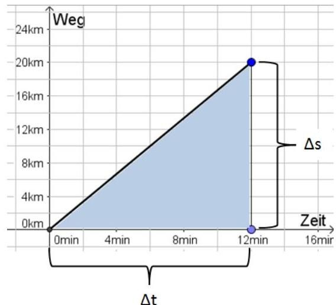

> **Bildbeschreibung:**
> Das Bild zeigt ein Weg-Zeit-Diagramm, das die Bewegung eines Objekts über einen Zeitraum von 12 Minuten darstellt.
> 
> Hier sind die wichtigsten Elemente und Details:
> 
> 1. **Achsen:**
>    - Die vertikale Achse ist mit "Weg" beschriftet und gibt die zurückgelegte Strecke in Kilometern an. Die Skalierung reicht von 0 km bis 24 km.
>    - Die horizontale Achse ist mit "Zeit" beschriftet und gibt die Zeit in Minuten an. Die Skalierung reicht von 0 Minuten bis 16 Minuten.
> 
> 2. **Graph:**
>    - Der Graph beginnt im Ursprung (0 km, 0 min).
>    - Bis zur 8. Minute steigt der Graph linear an und erreicht eine Strecke von 20 km.
>    - Zwischen der 8. und 12. Minute bleibt die Strecke konstant bei 20 km, was bedeutet, dass das Objekt in diesem Zeitraum nicht weiter vorankommt.
> 
> 3. **Bereiche und Markierungen:**
>    - Der Bereich unter dem Graphen ist blau schattiert und stellt die zurückgelegte Strecke über die Zeit dar.
>    - Δs (Delta s) markiert die vertikale Differenz der Strecke zwischen zwei Zeitpunkten, hier zwischen 8 und 12 Minuten, wo die Strecke konstant bleibt.
>    - Δt (Delta t) markiert den Zeitraum von 12 Minuten

$$
v = \frac{s}{t}
$$

$$
v = \text{Geschwindigkeit} \, [\mathrm{m/s}]
$$

$$
s = \text{Weg} \, [\mathrm{m}]
$$

$$
t = \text{Zeit} \, [\mathrm{s}]
$$

$$
t = \frac{s}{v}
$$

$$
s = v \cdot t
$$

Auch der zurückgelegte Weg kann in einem Diagramm sichtbar gemacht werden. Wir verwenden dazu aber ein:

## GESCHWINDIGKEITS-ZEIT-DIAGRAMM

Fahrzeug aus unserem Beispiel bewegt sich in 3 Sekunden 4 Meter weit. Daher gilt:

$$
v = \frac{s}{t} = \frac{4m}{3s} = 1,33 \, \frac{\mathrm{m}}{\mathrm{s}}
$$

Da die Geschwindigkeit immer gleich bleibt, entsteht im v-t-Diagramm eine horizontale Linie.

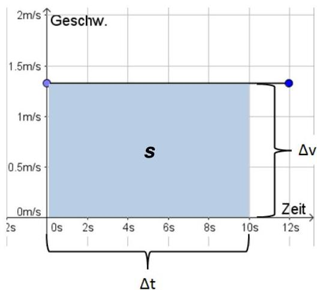

> **Bildbeschreibung:**
> Das Bild zeigt ein Geschwindigkeits-Zeit-Diagramm, das die Bewegung eines Objekts über die Zeit darstellt.
> 
> Hier sind die wichtigsten Elemente und Details:
> 
> 1. **Achsen:**
>    - Die vertikale Achse ist mit "Geschw." (Geschwindigkeit) beschriftet und hat eine Skala von 0 m/s bis 2 m/s.
>    - Die horizontale Achse ist mit "Zeit" beschriftet und hat eine Skala von 0 Sekunden bis 12 Sekunden.
> 
> 2. **Geschwindigkeit:**
>    - Die Geschwindigkeit bleibt über einen Zeitraum von 0 bis 10 Sekunden konstant bei 1.5 m/s.
>    - Nach 10 Sekunden sinkt die Geschwindigkeit abrupt auf 0 m/s und bleibt dort bis 12 Sekunden.
> 
> 3. **Fläche unter der Kurve:**
>    - Die Fläche unter der Geschwindigkeitskurve ist blau markiert und mit "s" (für Weg) gekennzeichnet. Diese Fläche repräsentiert den zurückgelegten Weg während der Bewegung.
> 
> 4. **Zeitintervalle und Änderungen:**
>    - Δt (Delta t) zeigt den gesamten Zeitverlauf von 0 bis 12 Sekunden.
>    - Δv (Delta v) zeigt die Änderung der Geschwindigkeit, die in diesem Fall von 1.5 m/s auf 0 m/s erfolgt.
> 
> Das Diagramm verdeutlicht, dass das Objekt für 10 Sekunden mit konstan

Geometrisch betrachtet berechnen wir im v-t-Diagramm bei der Bestimmung des Wegs $s$ ein Rechteck. Eine Seite ist dabei die Geschwindigkeit $v$ und die andere Seite die Zeit $t$.

$$
s = v \cdot t = 1,33 \, \frac{\mathrm{m}}{\mathrm{s}} \cdot 10 \, \mathrm{s} = 13,3 \, \mathrm{m}
$$

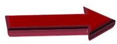

> **Bildbeschreibung:**
> Das Bild zeigt einen einzelnen, dreidimensionalen Pfeil. Der Pfeil ist in einer kräftigen, leuchtend roten Farbe gehalten und weist eine leicht glänzende Oberfläche auf, was ihm einen modernen und dynamischen Look verleiht.
> 
> Der Pfeil ist nach rechts gerichtet und hat eine leicht spitze Form, was seine Funktion als Richtungsanzeiger unterstreicht. Die Spitze des Pfeils ist weiß und kontrastiert deutlich mit dem roten Körper.
> 
> Der Pfeil ist nicht mit Text oder anderen grafischen Elementen versehen. Er steht frei und ohne Hintergrund, was ihn als zentrales und einziges Element im Bild hervorhebt. Der Pfeil scheint in einem neutralen, weißen Raum zu schweben, was seine klare und einfache Botschaft betont.

Im v-t-Diagramm entspricht die Fläche unter der Geschwindigkeitslinie dem zurückgelegten Weg $s$.

**Zusatzmaterial:**

- gleichförmige gradlinige Bewegung

Skript MAPH 1. Sem. PR-GF Lehrer, V1.0
MT
28/37

---

[Seite: 30]

BBW Berufsbildungsschule Winterthur Abteilung Maschinenbau

# 5.2.1 Übungsaufgaben: s-t- und v-t-Diagramme

1. Ein Radfahrer fährt von A nach B und misst dabei folgende Distanzen und Zeiten:

|  Weg Δs [km] | Zeit Δt [min]  |
| --- | --- |
|  1 | 3  |
|  0,5 | 3  |
|  1 | 1,5  |
|  0,5 | 4,5  |

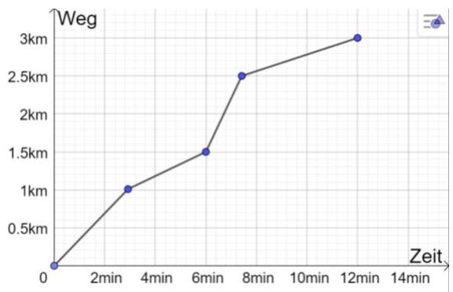

> **Bildbeschreibung:**
> Das Bild zeigt ein Diagramm, das die Beziehung zwischen Zeit (Zeitachse) und Weg (Wegachse) darstellt.
> 
> Hier sind die wichtigsten Elemente des Diagramms:
> 
> 1. **Achsen:**
>    - Die horizontale Achse ist mit "Zeit" beschriftet und ist in Minuten unterteilt (0, 2, 4, 6, 8, 10, 12, 14 Minuten).
>    - Die vertikale Achse ist mit "Weg" beschriftet und ist in Kilometern unterteilt (0, 0.5, 1, 1.5, 2, 2.5, 3 km).
> 
> 2. **Datenpunkte und Linie:**
>    - Es gibt fünf markante Datenpunkte, die durch blaue Punkte auf der Linie dargestellt sind.
>    - Die Linie verbindet diese Punkte und zeigt den Wegverlauf über die Zeit.
> 
> 3. **Wegverlauf:**
>    - Zu Beginn (0 Minuten) ist der Weg 0 km.
>    - Nach 4 Minuten ist der Weg etwa 1 km.
>    - Nach 6 Minuten ist der Weg etwa 1.5 km.
>    - Nach 8 Minuten ist der Weg etwa 2.5 km.
>    - Nach 12 Minuten ist der Weg etwa 3 km.
> 
> Das Diagramm zeigt also, dass der Weg über die Zeit kontinuierlich zunimmt, wobei die

Erstellen Sie ein entsprechendes s-t-Diagramm

2. Ein Fahrzeug bewegt sich von A nach B. Dabei wird seine Bewegung aufgezeichnet. Füllen Sie aufgrund der Diagrammdaten die Tabelle aus:

|  Weg s [km] | Zeit t [min]  |
| --- | --- |
|  4 | 2  |
|  8 | 6,6  |
|  10 | 7,3  |
|  12 | 8  |
|  15 | 10,3  |
|  17 | 11,7  |
|  20 | 14  |

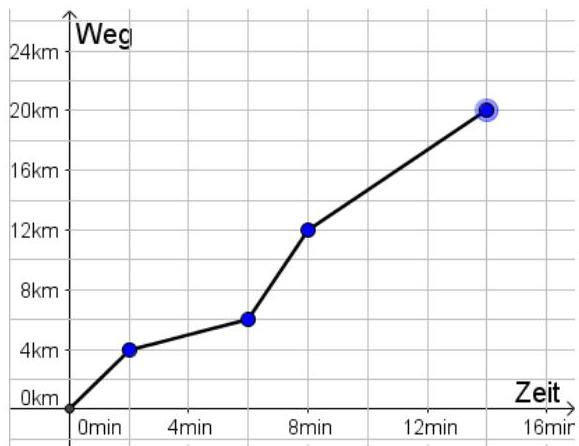

> **Bildbeschreibung:**
> Das Bild zeigt ein Diagramm, das die Beziehung zwischen Weg (in Kilometern) und Zeit (in Minuten) darstellt.
> 
> Hier sind die wichtigsten Elemente des Diagramms:
> 
> 1. **Achsen:**
>    - Die vertikale Achse (y-Achse) ist mit "Weg" beschriftet und reicht von 0 km bis 24 km.
>    - Die horizontale Achse (x-Achse) ist mit "Zeit" beschriftet und reicht von 0 Minuten bis 16 Minuten.
> 
> 2. **Datenpunkte:**
>    - Es gibt fünf blaue Punkte, die verschiedene Positionen auf dem Graphen markieren.
>    - Die Punkte sind bei folgenden Koordinaten:
>      - (0 min, 0 km)
>      - (4 min, 4 km)
>      - (8 min, 6 km)
>      - (12 min, 12 km)
>      - (16 min, 20 km)
> 
> 3. **Linienverlauf:**
>    - Die Punkte sind durch eine schwarze Linie verbunden, die den Wegverlauf über die Zeit zeigt.
>    - Der Verlauf zeigt eine nicht-lineare Zunahme des zurückgelegten Weges über die Zeit, wobei die Steigung zwischen den einzelnen Zeitpunkten variiert.
> 
> Das Diagramm scheint also die Bewegung einer Person oder eines Objekts darzustellen, das in den ersten 4 Minuten 4 km zurücklegt, dann in den nächsten

3. Übertragen Sie die Informationen aus dem s-t-Diagramm ins v-t-Diagramm.

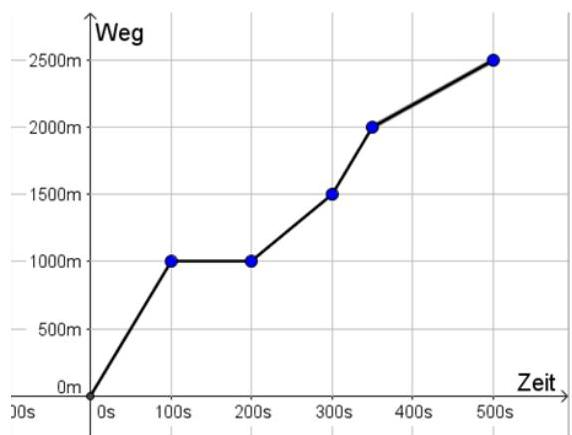

> **Bildbeschreibung:**
> Das Bild zeigt ein Diagramm, das die Beziehung zwischen Weg (in Metern) und Zeit (in Sekunden) darstellt.
> 
> Hier sind die wichtigsten Elemente des Diagramms:
> 
> 1. **Achsen:**
>    - Die vertikale Achse ist mit "Weg" beschriftet und zeigt die Distanz in Metern (m) an, beginnend bei 0 m bis hin zu 2500 m.
>    - Die horizontale Achse ist mit "Zeit" beschriftet und zeigt die Zeit in Sekunden (s) an, beginnend bei 0 s bis hin zu 500 s.
> 
> 2. **Datenpunkte und Linie:**
>    - Es gibt fünf markante Datenpunkte, die durch blaue Punkte auf der Linie dargestellt sind.
>    - Die Linie verbindet diese Punkte und zeigt den Verlauf des Weges über die Zeit.
> 
> 3. **Verlauf der Linie:**
>    - Von 0 s bis 100 s steigt der Weg schnell von 0 m auf etwa 1000 m an.
>    - Zwischen 100 s und 200 s bleibt der Weg bei etwa 1000 m konstant.
>    - Von 200 s bis 300 s steigt der Weg wieder, diesmal auf etwa 1500 m.
>    - Zwischen 300 s und 400 s steigt der Weg weiter auf etwa 2000 m

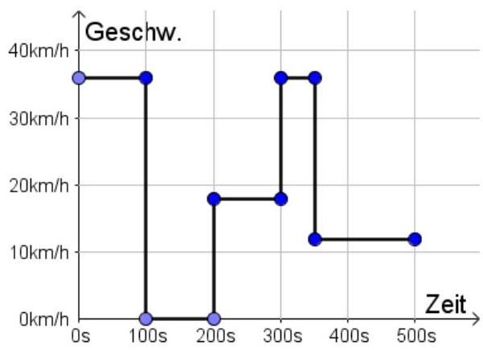

> **Bildbeschreibung:**
> Das Bild zeigt ein Geschwindigkeits-Zeit-Diagramm (auch bekannt als v-t-Diagramm).
> 
> Hier sind die wichtigsten Elemente:
> 
> 1. **Achsen:**
>    - Die vertikale Achse ist mit "Geschw." (Geschwindigkeit) beschriftet und reicht von 0 km/h bis 40 km/h.
>    - Die horizontale Achse ist mit "Zeit" (Zeit) beschriftet und reicht von 0 Sekunden bis 500 Sekunden.
> 
> 2. **Datenpunkte und Linien:**
>    - Die Datenpunkte sind als blaue Kreise dargestellt.
>    - Die Linien verbinden diese Punkte und zeigen die Geschwindigkeitsänderungen über die Zeit.
> 
> 3. **Geschwindigkeitsverlauf:**
>    - Von 0s bis 100s: Die Geschwindigkeit ist konstant bei 35 km/h.
>    - Bei 100s fällt die Geschwindigkeit abrupt auf 0 km/h und bleibt dort bis 150s.
>    - Von 150s bis 200s steigt die Geschwindigkeit wieder auf etwa 18 km/h an.
>    - Zwischen 200s und 300s bleibt die Geschwindigkeit bei 18 km/h konstant.
>    - Bei 300s steigt die Geschwindigkeit wieder auf 35 km/h und bleibt bis 350s konstant.
>    - Bei 350s fällt

Skript MAPH 1. Sem. PR-GF Lehrer, V1.0

29/37

---

[Seite: 31]

BBW Berufsbildungsschule Winterthur
Abteilung Maschinenbau

# 5.2.2 Lösungsweg beim Erarbeiten von Physikaufgaben

Ein strukturierter Lösungsweg ist bei Physikaufgaben für den Erfolg entscheidend.

Versuchen Sie die nachfolgenden Aufgaben so zu lösen, wie Sie es für sinnvoll halten und vergleichen Sie anschließend Ihren Weg mit der Musterlösung.

## Aufgabe 1

Ein Fussgänger läuft von Winterthur nach Bülach. Die Strecke beträgt 24,8 km. Wie lange ist er unterwegs, wenn er mit einer Geschwindigkeit von $1,5 \, \text{m/s}$ marschiert? Geben Sie das Resultat in Stunden, Minuten und Sekunden an.

### MUSTERLÖSUNG

Geg: $s = 24,8 \, \text{km} = 24'800 \, \text{m}$, $v = 1,5 \, \text{m/s}$

Ges: $t$

Formaler Ansatz: $t = \frac{s}{v}$

Lösung: $t = \frac{s}{v} = \frac{24'800 \, \text{m}}{1,5 \, \text{m/s}} = 16'533 \, \text{s}$

Umrechnen: $t = 16'533 \, \text{s} = \frac{16'533 \, \text{s}}{3600 \, \frac{\text{s}}{\text{h}}} = 4,5925 \, \text{h} = 4 \, \text{h} \, 35 \, \text{min} \, 33 \, \text{s}$

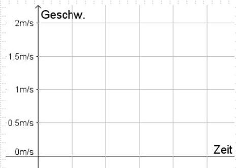

> **Bildbeschreibung:**
> Das Bild zeigt ein Koordinatensystem mit den Achsen "Geschw." (Geschwindigkeit) und "Zeit" (Zeit).
> 
> - Die vertikale Achse ist mit "Geschw." beschriftet und gibt die Geschwindigkeit in Metern pro Sekunde (m/s) an. Die Skala reicht von 0 m/s bis 2 m/s.
> - Die horizontale Achse ist mit "Zeit" beschriftet, allerdings ist keine spezifische Skala oder Einheit für die Zeit angegeben.
> 
> Das Koordinatensystem selbst ist in ein Raster unterteilt, das aus gleichmäßigen Quadraten besteht, um die Werte besser ablesen zu können. Es gibt keine weiteren graphischen Darstellungen oder Linien im Koordinatensystem, die eine bestimmte Bewegung oder Veränderung der Geschwindigkeit über die Zeit zeigen.

## Aufgabe 2

Ein Schwimmer überquert einen $2 \, \text{km}$ breiten See in $42 \, \text{min}$. Wie hoch ist seine Geschwindigkeit?

### MUSTERLÖSUNG

Geg: $s = 2 \, \text{km} = 2'000 \, \text{m}$, $t = 42 \, \text{min} = 0,7 \, \text{h} = 2'520 \, \text{s}$

Ges: $v$

Formaler Ansatz: $v = \frac{s}{t}$

Lösung Var.1: $v = \frac{s}{t} = \frac{2 \, \text{km}}{42 \, \text{min}} = 0,0476 \, \frac{\text{km}}{\text{min}}$ (unüblich aber nicht falsch)

Lösung Var.2: $v = \frac{s}{t} = \frac{2 \, \text{km}}{0,7 \, \text{h}} = 2,86 \, \frac{\text{km}}{\text{h}}$ (gängige Einheit)

Lösung Var.3: $v = \frac{s}{t} = \frac{2'000 \, \text{m}}{2'520 \, \text{s}} = 0,794 \, \frac{\text{m}}{\text{s}}$ (SI-Basiseinheiten)

Skript MAPH 1. Sem. PR-GF Lehrer, V1.0
MT
30/37

---

[Seite: 32]

BBW Berufsbildungsschule Winterthur
Abteilung Maschinenbau

# 5.2.3 Übungsaufgaben: Gleichförmige, gradlinige Bewegung
Lösen Sie nachfolgende Aufgaben auf einem separaten Blatt

1. Ein Auto fährt in 2 Stunden und 45 Minuten von A nach B. Die beiden Orte liegen 156km auseinander. Wie hoch ist die durchschnittliche Geschwindigkeit?
$$
v = 56,7 \frac{km}{h}
$$

2. Welchen Weg legt ein Motorrad zurück, wenn es während 1 Stunde und 35 Minuten mit einer Geschwindigkeit von 58 km/h fährt?
$$
s = 91,8 \text{km}
$$

3. Die Entfernung zwischen Erde und Sonne beträgt 150 Millionen Kilometer. Wie viele Minuten benötigt das Licht von der Sonne zu uns, wenn die Lichtgeschwindigkeit c=300'000 km/s beträgt?
$$
t = 8,33 \text{min}
$$

4. Eine hydraulische Stangenpresse produziert mit einer Geschwindigkeit von 6 m/min. Wie lange Dauert die Produktion von Profilrohren mit einer Gesamtlänge von 27,75m?
$$
t = 4,625 \text{min}
$$

5. Ein Schweisser hat eine Kehlnaht mit einer Länge von 1375 mm mit einer Geschwindigkeit von 110 mm/min produziert. Wie lange dauerte der ganze Vorgang, wenn er dazwischen noch während 2,5 min vom Chef unterbrochen wurde?
$$
t = 15 \text{min}
$$

6. Bestimmen Sie die drei Geschwindigkeiten eines Wanderers aus dem nebenstehenden Diagramm in km/h.
$$
\begin{array}{l}
0 - 2h \Rightarrow v = 7,5 \frac{km}{h} \\
2 - 3,5h \Rightarrow v = 1,67 \frac{km}{h} \\
3,5 - 5h \Rightarrow v = 8,33 \frac{km}{h}
\end{array}
$$

7. Learningapps.org
Weg-Zeit-Diagramm

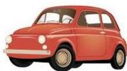

> **Bildbeschreibung:**
> Das Bild zeigt ein klassisches Auto, das an einen Fiat 500 erinnert. Hier sind die wichtigsten Details:
> 
> - **Farbe und Design**: Das Auto ist in einem leuchtenden Orange-Rot gehalten, was ihm einen nostalgischen Charme verleiht. Es hat eine klassische, runde Form mit großen, runden Scheinwerfern und einem kleinen, runden Kühlergrill.
> - **Fahrzeugtyp**: Es handelt sich um ein zweisitziges Cabriolet, erkennbar an der fehlenden Dachstruktur und den seitlichen Fenstern, die sich nach oben öffnen lassen.
> - **Räder**: Das Auto hat weiße Felgen mit schwarzen Reifen, die gut zu der klassischen Optik passen.
> - **Hintergrund**: Der Hintergrund ist weiß und unauffällig, sodass das Auto im Mittelpunkt steht.
> - **Kontext**: Das Bild scheint das Auto in einer neutralen Umgebung zu zeigen, ohne weitere Objekte oder Details, die den Kontext näher bestimmen würden.
> 
> Es gibt keinen sichtbaren Text oder weitere Elemente, die im Bild enthalten wären. Das Auto steht scheinbar allein und wird in einer klaren, einfachen Darstellung gezeigt.

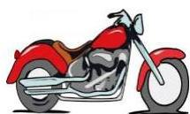

> **Bildbeschreibung:**
> Das Bild zeigt eine Illustration eines Motorrads in einer seitlichen Perspektive. Das Motorrad ist in einer Kombination aus Rot und Schwarz gehalten, wobei der Hauptkörper des Motorrads rot und die Details wie der Tank, die Sitzbank und die Felgen schwarz sind.
> 
> Das Motorrad hat eine klassische Bauweise mit einem großen, runden Tank, der sich über die gesamte Breite des Motorrads erstreckt. Der Sitz ist breit und bequem geformt, und das Motorrad verfügt über zwei seitliche Spiegel, die symmetrisch angeordnet sind.
> 
> Die Felgen sind schmal und mit einer typischen Speichenkonstruktion versehen. Das Motorrad steht auf zwei stabilen Rädern, die durch eine durchgehende Achse verbunden sind.
> 
> Das Bild enthält keine erkennbaren Texte oder Personen und zeigt ausschließlich das Motorrad in einer ruhigen, statischen Pose. Die Illustration wirkt einfach und klar, ohne zusätzliche Details oder Hintergründe.

> **Bildbeschreibung:**
> Das Bild zeigt eine grafische Darstellung der Erde, die von der Sonne beleuchtet wird.
> 
> - **Erde**: Die Erde ist zentral im Bild platziert und in typischen Farben dargestellt: Blau für die Ozeane und Grün für die Landmassen. Sie ist leicht schräg gezeichnet, sodass die Kontinente wie Europa, Afrika und Asien erkennbar sind.
> - **Sonne**: Die Sonne befindet sich links oben im Bild und ist als gelber Kreis mit Strahlen dargestellt. Die Strahlen deuten darauf hin, dass die Sonne die Erde beleuchtet.
> - **Lichtstrahlen**: Die Sonne sendet Lichtstrahlen zur Erde, die als gelbe Linien dargestellt sind. Diese Linien zeigen die Richtung des Sonnenlichts und wie es die Erde erreicht.
> 
> Es gibt keinen sichtbaren Text im Bild. Die Darstellung vermittelt den Eindruck von Tag auf der Erde, da die beleuchtete Seite der Erde sichtbar ist.

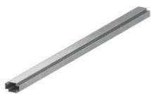

> **Bildbeschreibung:**
> Das Bild zeigt eine einzelne, silberne Metallstange. Die Stange hat eine leicht gebogene Form und ist an beiden Enden mit einer kleinen, quadratischen Aussparung versehen. Die Stange liegt auf einer weißen Fläche und ist leicht nach oben geneigt, sodass sie nicht vollständig horizontal ausgerichtet ist. Es gibt keine weiteren Objekte oder Texte im Bild. Die Stange wirkt neu und unbenutzt.

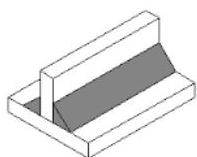

> **Bildbeschreibung:**
> Das Bild zeigt eine perspektivische Darstellung eines einfachen, rechteckigen Behälters mit einem Deckel.
> 
> Hier sind die Details:
> 
> 1. **Behälter**:
>    - Der Behälter hat eine flache, rechteckige Form.
>    - Er besitzt eine leicht erhöhte, mittige Wand, die sich von der Vorder- zur Rückseite erstreckt. Diese Wand ist höher als die anderen Wände des Behälters.
> 
> 2. **Deckel**:
>    - Der Deckel liegt schräg auf dem Behälter und ist ebenfalls rechteckig.
>    - Der Deckel ist teilweise transparent und zeigt eine graue Fläche, die sich von der Vorder- zur Rückseite des Behälters erstreckt.
> 
> 3. **Farbe und Material**:
>    - Der Behälter und der Deckel scheinen aus einem einheitlichen Material zu bestehen, das eine helle, fast weiße Farbe hat.
>    - Die graue Fläche auf dem Deckel könnte ein anderes Material oder eine Beschichtung darstellen.
> 
> 4. **Kontext**:
>    - Es gibt keine weiteren Objekte oder Details im Bild, die auf einen spezifischen Kontext hinweisen.
>    - Es könnte sich um eine technische Zeichnung oder ein Modell handeln, das zur Veranschaulichung von Formen und Strukturen dient.
> 
> Es ist kein Text oder weitere spezifische Details im Bild zu erkennen.

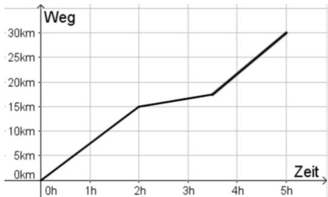

> **Bildbeschreibung:**
> Das Bild zeigt ein Diagramm, das den Zusammenhang zwischen Weg (in Kilometern) und Zeit (in Stunden) darstellt.
> 
> - Die x-Achse (horizontal) ist mit "Zeit" beschriftet und reicht von 0 Stunden bis 5 Stunden.
> - Die y-Achse (vertikal) ist mit "Weg" beschriftet und reicht von 0 km bis 30 km.
> 
> Die Kurve im Diagramm beginnt am Ursprung (0h, 0km) und steigt zunächst linear an, bis sie nach etwa 2 Stunden bei 15 km Wegstrecke ankommt. Danach flacht die Steigung der Kurve leicht ab, was bedeutet, dass die zurückgelegte Strecke pro Zeit etwas langsamer zunimmt. Nach etwa 3 Stunden erreicht die Kurve wieder eine stärkere Steigung und steigt bis zum Ende der 5 Stunden auf 30 km an.
> 
> Zusammengefasst zeigt das Diagramm, dass die zurückgelegte Strecke in den ersten zwei Stunden relativ schnell zunimmt, danach etwas langsamer wird und gegen Ende der Messperiode wieder schneller zunimmt.

> **Bildbeschreibung:**
> Das Bild zeigt einen QR-Code. QR-Codes sind zweidimensionale Barcodes, die Informationen in Form von Pixeln speichern und mit speziellen Apps oder Geräten ausgelesen werden können.
> 
> In diesem Fall:
> - Der QR-Code besteht aus einem Muster von schwarzen und weißen Quadraten.
> - Die Größe des QR-Codes ist relativ klein und füllt das Bild fast vollständig aus.
> - Es gibt keine weiteren Elemente oder Texte im Bild, nur den QR-Code selbst.
> 
> Da QR-Codes oft für schnellen Zugriff auf digitale Inhalte wie Webseiten, Kontaktdaten oder andere Informationen genutzt werden, könnte dieser Code auf eine bestimmte Website, ein Dokument oder eine Anwendung verweisen. Ohne spezielle Software oder ein Smartphone mit QR-Code-Scanner ist es jedoch nicht möglich, den genauen Inhalt zu entschlüsseln.

Skript MAPH 1. Sem. PR-GF Lehrer, V1.0
MT
31/37

---

[Seite: 33]

图

BBW Berufsbildungsschule Winterthur Abteilung Maschinenbau

# 5.3 Gleichförmige Kreisbewegung

Bewegt sich ein Körper mit konstanter Geschwindigkeit auf einer kreisförmigen Bahn, so nennt man diese Bewegung eine gleichförmige Kreisbewegung.

Die Geschwindigkeit dieses Körpers wird als Umfangsgeschwindigkeit $v_u$ bezeichnet. Befindet sich auf diesem Umfang eine Schneide, wie z.B. beim Fräser oder einer Kreissäge, so spricht man von einer Schnittgeschwindigkeit $v_c$.

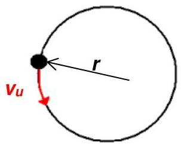

> **Bildbeschreibung:**
> Das Bild zeigt eine schematische Darstellung eines physikalischen Prinzips, das mit der Kreisbewegung zu tun hat.
> 
> 1. **Kreisbahn**: Im Zentrum des Bildes ist ein schwarzer Punkt, der sich auf einer Kreisbahn bewegt. Die Kreisbahn ist als durchgehende Linie dargestellt.
> 
> 2. **Radius (r)**: Vom schwarzen Punkt aus geht eine Linie nach außen, die den Radius des Kreises (r) darstellt. Diese Linie ist mit einem kleinen "r" beschriftet.
> 
> 3. **Geschwindigkeit (Vu)**: Eine rote Pfeilspitze, die mit "Vu" beschriftet ist, zeigt tangential zur Kreisbahn. Diese Pfeilspitze deutet die Geschwindigkeit des Punktes auf seiner Kreisbahn an, auch bekannt als Umfangsgeschwindigkeit.
> 
> Zusammengefasst: Das Bild illustriert einen Punkt, der sich mit einer bestimmten Geschwindigkeit (Vu) auf einer Kreisbahn mit dem Radius (r) bewegt. Es handelt sich um eine typische Darstellung in der Physik, um die Bewegung eines Objekts in einer kreisförmigen Bahn zu beschreiben.

In unserem Umfeld, sei es im Alltag oder am Arbeitsplatz, bewegen sich sehr viele Dinge auf einer kreisförmigen Bahn.

> **Bildbeschreibung:**
> Das Bild zeigt eine Achterbahnattraktion, die als Schwingende Karussell-Achterbahn bekannt ist. Hier sind die wichtigsten Elemente und Details:
> 
> 1. **Hauptstruktur**: Im Zentrum des Bildes steht ein hoher, grauer Stahlmast, der die gesamte Attraktion trägt. Dieser Mast ist mit gelben Streben und Querverbindungen verstärkt, die sich nach oben hin verjüngen.
> 
> 2. **Sitzanordnung**: An diesem Mast sind mehrere Sitzreihen befestigt, die in Form eines Kreises oder einer Spirale angeordnet sind. Jede Sitzreihe besteht aus mehreren Sitzen, die in verschiedenen Farben lackiert sind, darunter Rot, Blau, Grün und Gelb.
> 
> 3. **Sitze**: Die Sitze sind an langen, gelben Streben befestigt, die sich vom Mast aus nach außen erstrecken. Die Sitze hängen frei in der Luft und können sich in einem Kreis um den Mast bewegen.
> 
> 4. **Hintergrund**: Der Himmel im Hintergrund ist klar und blau, mit einigen weißen Wolken, was auf ein sonniges und angenehmes Wetter hinweist.
> 
> 5. **Kein sichtbarer Text**: Im Bild sind keine Texte oder Beschriftungen erkennbar.
> 
> Diese Art von Attraktion ist typisch für Freizeitparks und bietet den Fahrgästen ein aufregendes Erlebnis durch die schnellen Bewegungen und die Höhe.

Karussell

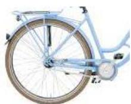

> **Bildbeschreibung:**
> Das Bild zeigt ein einzelnes Fahrrad, das in einem leicht schrägen Winkel von der Seite fotografiert wurde. Das Fahrrad ist in einem hellen, pastellblauen Farbton lackiert, was ihm einen freundlichen und modernen Look verleiht.
> 
> Das Fahrrad besitzt einen dünnen, schwarzen Lenker, der mit einem weißen Lenkrad ausgestattet ist. Die Reifen sind ebenfalls schwarz und haben einen weißen Rand, was einen interessanten Kontrast zum blauen Rahmen bildet.
> 
> Das Fahrrad hat eine klassische Bauweise mit einem einzigen Gang, erkennbar an der einfachen Kette und dem Ritzel am Hinterrad. Der Rahmen ist schlank und elegant, mit einer leichten Krümmung, die typisch für viele moderne Fahrräder ist.
> 
> Es gibt keine weiteren Objekte oder Personen im Bild, und es ist kein Text oder Logo auf dem Fahrrad sichtbar. Der Fokus liegt ausschließlich auf dem Fahrrad selbst.

Fahrrad

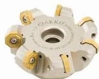

> **Bildbeschreibung:**
> Das Bild zeigt eine spezielle Art von Fräser, der für die Holzverarbeitung verwendet wird. Der Fräser hat eine kreisförmige Form und ist in der Mitte mit einem Loch versehen. An den vier Ecken des Fräsers sind jeweils zwei gelbe Schrauben befestigt, die vermutlich zur Befestigung des Fräsers an einer Maschine dienen.
> 
> Der Fräser selbst ist weiß und hat eine leicht glänzende Oberfläche. Auf der Oberfläche des Fräsers ist der Text "DARCO" und "1000" zu erkennen, was möglicherweise auf die Marke oder das Modell des Fräsers hinweist.
> 
> Der Fräser ist auf einem weißen Hintergrund platziert, was die Farben und Details des Fräsers gut zur Geltung bringt. Der Fräser scheint sich in einem ruhigen Zustand zu befinden, ohne Anzeichen von Bewegung oder Nutzung.

Fräser

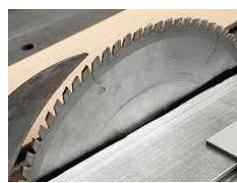

> **Bildbeschreibung:**
> Das Bild zeigt zwei Kreissägeblätter, die auf einer Holzunterlage liegen.
> 
> 1. **Kreissägeblätter**:
>    - Beide Sägeblätter sind aus Metall und haben eine graue Farbe.
>    - Die Zähne der Sägeblätter sind scharf und gleichmäßig angeordnet, was typisch für präzise Schneidearbeiten ist.
>    - Die Sägeblätter haben unterschiedliche Größen: Das obere Sägeblatt ist kleiner als das untere.
> 
> 2. **Holzunterlage**:
>    - Die Sägeblätter liegen auf einer hellen, glatten Holzunterlage, die vermutlich als Schutz für die Arbeitsfläche dient.
> 
> 3. **Kontext**:
>    - Die Szene deutet auf eine Werkstatt oder einen Bereich hin, in dem Holz bearbeitet wird.
>    - Die Anordnung der Sägeblätter könnte darauf hindeuten, dass sie für verschiedene Aufgaben oder Materialstärken verwendet werden.
> 
> Es sind keine weiteren Details oder Texte im Bild erkennbar.

Kreissäge

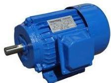

> **Bildbeschreibung:**
> Das Bild zeigt einen einzelnen Elektromotor, der in einem kräftigen Blau lackiert ist. Der Motor hat eine zylindrische Form und ist auf der linken Seite mit einem Metallschaft ausgestattet, der vermutlich zur Befestigung oder zum Antrieb dient.
> 
> Auf der rechten Seite des Motors befindet sich ein weißes Schild mit schwarzem Text. Der Text auf dem Schild ist jedoch nicht vollständig lesbar, aber es scheint sich um technische Spezifikationen oder Markierungsinformationen zu handeln.
> 
> Der Motor steht auf einer weißen Fläche, die den Hintergrund bildet. Es gibt keine weiteren Objekte oder Elemente im Bild, sodass der Fokus vollständig auf dem Motor liegt. Der Kontext könnte ein technischer oder industrieller Bereich sein, da es sich um ein typisches Bauteil für Maschinen und Anlagen handelt.

E-Motor

## Drehzahl n

Unter der Drehzahl $n$ versteht man das Verhältnis zwischen der Anzahl Umdrehungen und der dafür benötigten Zeit.

Oder einfacher formuliert: Wie oft dreht sich etwas in einer Minute oder in einer Sekunde?

$$
n = \frac{N}{t}
$$

$n = \text{Drehzahl} \left[\frac{1}{s}\right]$

$N = \text{Anzahl Umdrehungen}$

$t = \text{Zeit} \left[s\right]$

## Zusatzmaterial:

- gleichförmige Kreisbewegung

## Umfangssgeschwindigkeit $v_u$

Grundsätzlich gilt für die kreisförmige Bewegung der gleiche formale Ansatz wie für die gradlinige Bewegung:

$$
v = \frac{s}{t}
$$

$$
s = U \cdot N = d \cdot \pi \cdot N
$$

$$
\Rightarrow v = \frac{s}{t} = \frac{d \cdot \pi \cdot N}{t} = d \cdot \pi \cdot n
$$

$$
v_u = d \cdot \pi \cdot n
$$

$n = \text{Drehzahl} \left[\frac{1}{s}\right]$

$v_u = \text{Umfangsgeschw.} \left[m/s\right]$

$d = \text{Durchmesser} \left[m\right]$

$$
n = \frac{v_u}{d \cdot \pi}
$$

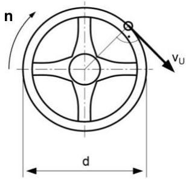

> **Bildbeschreibung:**
> Das Bild zeigt eine schematische Darstellung eines rotierenden Rades oder einer Scheibe, wie sie oft in der Technik oder Physik verwendet wird.
> 
> Hier sind die wichtigsten Elemente und Details:
> 
> 1. **Scheibe/Rad:**
>    - Die zentrale Form ist eine kreisförmige Scheibe mit einem Durchmesser \(d\).
>    - Die Scheibe hat drei Aussparungen oder Öffnungen, die symmetrisch verteilt sind.
> 
> 2. **Bewegungsvektoren:**
>    - Ein Pfeil mit der Beschriftung \(v_U\) zeigt tangential an der Peripherie der Scheibe nach außen. Dies deutet auf die Umfangsgeschwindigkeit \(v_U\) hin, also die Geschwindigkeit eines Punktes auf dem Rand der Scheibe.
>    - Ein weiterer Pfeil mit der Beschriftung \(n\) zeigt senkrecht zur Scheibenebene nach oben. Dies steht für die Drehzahl \(n\) der Scheibe, also die Anzahl der Umdrehungen pro Zeiteinheit.
> 
> 3. **Radius \(r\):**
>    - Ein Radius \(r\) ist eingezeichnet, der von der Mitte der Scheibe zu einem Punkt auf der Peripherie zeigt. Dieser Radius ist wichtig, um die Umfangsgeschwindigkeit \(v_U\) zu berechnen, da \(v_U = r \cdot \omega\) (mit \(\omega\) als Winkelgeschwindigkeit).
> 
> 4. **Koordinaten und Achsen:**
>    - Die Scheibe ist in einem Koordinatens

$$
d = \frac{v_u}{n \cdot \pi}
$$

Skript MAPH 1. Sem. PR-GF Lehrer, V1.0

MT

---

[Seite: 34]

BBW Berufsbildungsschule Winterthur Abteilung Maschinenbau

# 5.3.1 Übungsaufgaben: Gleichförmige Kreisbewegung

1. Das Rad eines Fahrrades hat eine Drehzahl $n = 2,5 \frac{1}{s}$. Mit welcher Geschwindigkeit fährt das Fahrrad, wenn der Raddurchmesser $d = 0,71m$ beträgt?

$$
\begin{array}{l}
\text{Geg: } n = 2,5 \frac{1}{s}, d = 0,7m \quad \text{Ges: } v_u \\
v_u = d \cdot \pi \cdot n = 0,71m \cdot \pi \cdot 2,5 \frac{1}{s} = 5,58 \frac{m}{s}
\end{array}
$$

2. Bestimmen Sie den Durchmesser $d$ der Riemenscheibe eines Elektromotors, wenn dieser eine Drehzahl $n = 1260 \frac{1}{min}$ hat und der Riemen mit einer Geschwindigkeit $v = 16 \frac{m}{s}$ laufen soll.

$$
\begin{array}{l}
\text{Geg: } n = 1260 \frac{1}{min} = 21 \frac{1}{s}, v = 16 \frac{m}{s} \quad \text{Ges: } d \\
d = \frac{v_u}{\pi \cdot n} = \frac{16 \frac{m}{s}}{\pi \cdot 21 \frac{1}{s}} = 0,243m = 243mm
\end{array}
$$

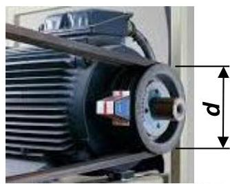

> **Bildbeschreibung:**
> Das Bild zeigt eine elektrische Maschine, vermutlich einen Elektromotor. Hier sind die wichtigsten Elemente und Details:
> 
> 1. **Elektromotor**:
>    - Der Motor hat ein zylindrisches Gehäuse mit einer glatten Oberfläche.
>    - Die vordere Seite des Motors ist mit Kühlrippen versehen, die der Wärmeabfuhr dienen.
>    - Der Motor ist mit einem Flansch ausgestattet, der zur Befestigung an einer Maschine oder einem Rahmen dient.
> 
> 2. **Anschlusskasten**:
>    - Auf der rechten Seite des Motors befindet sich ein Anschlusskasten, der für die elektrische Verbindung und Steuerung des Motors zuständig ist.
>    - Der Anschlusskasten ist mit einem Deckel versehen, der teilweise geöffnet ist, um die internen Komponenten zu zeigen.
> 
> 3. **Maßangabe**:
>    - Im Bild ist eine Maßeinheit mit dem Buchstaben "d" markiert, die die Breite des Motors anzeigt. Diese Angabe könnte auf eine technische Spezifikation oder eine Dimensionierung des Motors hinweisen.
> 
> 4. **Umgebung**:
>    - Der Motor scheint in einer Werkstatt oder einem industriellen Umfeld zu sein, da er auf einem Metallgestell oder einer Arbeitsplatte montiert ist.
> 
> Es gibt keinen sichtbaren Text im Bild. Die Darstellung ist rein technisch und konzentriert sich auf die Struktur und Komponenten des Elektromotors.

3. Ein Auto fährt mit einer Geschwindigkeit $v = 81 \frac{km}{h}$. Die Räder haben einen Durchmesser $d = 65cm$. Wie gross ist ihre Drehzahl $n$ in $\frac{1}{min}$?

$$
\begin{array}{l}
\text{Geg: } v = 81 \frac{km}{h} = 22,5 \frac{m}{s}, d = 65cm = 0,65m \quad \text{Ges: } n \\
n = \frac{v_u}{\pi \cdot d} = \frac{22,5 \frac{m}{s}}{\pi \cdot 0,65m} = 11,0 \frac{1}{s} = 661 \frac{1}{min}
\end{array}
$$

4. Welchen Durchmesser $d$ in $cm$ hat die Trommel eines Wäschetrockners, wenn sie eine Umfangsgeschwindigkeit $v_u = 115 \frac{m}{s}$ und eine Drehzahl $n = 5'230 \frac{1}{min}$ aufweist?

$$
\begin{array}{l}
\text{Geg: } n = 87,17 \frac{1}{s}, v_u = 115 \frac{m}{s} \quad \text{Ges: } d \ [cm] \\
d = \frac{v_u}{\pi \cdot n} = \frac{115 \frac{m}{s}}{\pi \cdot 87,17 \frac{1}{s}} = 0,42m = 42cm
\end{array}
$$

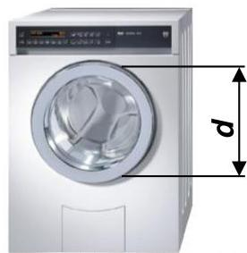

> **Bildbeschreibung:**
> Das Bild zeigt eine weiße Waschmaschine mit einem Frontlader. Die Maschine steht auf einem weißen Untergrund und ist leicht nach links geneigt. Die Tür der Waschmaschine ist offen, und man kann das Innere der Maschine sehen.
> 
> Auf der Maschine befindet sich ein digitales Display mit mehreren Knöpfen und Tasten. Diese sind in einer Reihe angeordnet und scheinen für die Steuerung der Waschfunktionen zuständig zu sein.
> 
> Eine wichtige Markierung im Bild ist die mit "d" bezeichnete Höhe der Waschmaschine. Diese Markierung deutet darauf hin, dass die Höhe der Maschine gemessen oder angegeben wird. Die genaue Höhe wird jedoch nicht im Bild selbst angegeben.
> 
> Es gibt keinen sichtbaren Text auf der Maschine, der eine spezifische Marke oder Modellnummer angibt. Die Maschine wirkt modern und sauber.

Skript MAPH 1. Sem. PR-GF Lehrer, V1.0

MT

---

[Seite: 35]

BBW Berufsbildungsschule Winterthur
Abteilung Maschinenbau

5* Die Zeigerspitze des kleinen Zeigers einer Turmuhr hat zur Achse einen Abstand von 0,9m. Welche Umfangsgeschwindigkeit $v_u$ in $\frac{mm}{min}$ hat die Zeigerspitze? Hinweis: Der Zeiger macht in 12 Stunden eine Umdrehung.

$$
n = \frac{1}{12h} = \frac{1}{720 \text{min}} = 0,0013889 \frac{1}{\text{min}}
$$

$$
Geg: r = 0,9m \Rightarrow d = 1,8m = 1800mm, n = \frac{1}{12h} = \frac{1}{720 \text{min}} \quad Ges: v_u \left( \frac{mm}{min} \right)
$$

$$
v_u = d \cdot \pi \cdot n = \frac{1}{800 \text{mm}} \cdot \pi \cdot \frac{1}{720 \text{min}} = 7,85 \frac{\text{mm}}{\text{min}}
$$

6. Auf einer Drehmaschine soll eine Welle von Durchmesser $d = 70,25\text{mm}$ auf $d = 70\text{mm}$ geschlichtet werden. Für das Werkstück lassen sich die folgenden Drehzahlen einstellen: $n = 90,120,180,240$ und $300 \frac{1}{\text{min}}$.

Welche muss gewählt werden, damit eine maximale Schnittgeschwindigkeit $v_c = 62 \frac{\text{m}}{\text{min}}$ nicht überschritten wird?

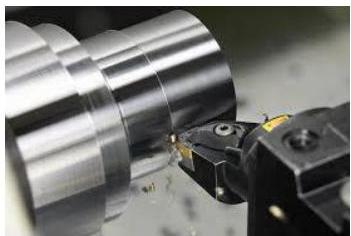

> **Bildbeschreibung:**
> Das Bild zeigt eine Nahaufnahme eines Präzisionswerkzeugs, das in einem industriellen Umfeld eingesetzt wird.
> 
> 1. **Hauptgegenstand**:
>    - Im Zentrum des Bildes befindet sich ein **Bohrer oder Fräser**, der an einer Maschine befestigt ist. Der Bohrer/Fräser hat eine scharfe Spitze und ist in Bewegung, wie durch die sichtbaren Funken und Metallspäne angedeutet.
> 
> 2. **Maschine**:
>    - Der Bohrer/Fräser ist in einer **metallischen Halterung** oder einem **Futter** befestigt, das Teil einer größeren Maschine ist. Diese Halterung scheint robust und präzise konstruiert zu sein, um den Bohrer/Fräser sicher zu halten und präzise Bewegungen zu ermöglichen.
> 
> 3. **Umgebung und Kontext**:
>    - Die Maschine steht auf einer **grauen, glatten Oberfläche**, die typisch für Werkstätten oder Produktionshallen ist.
>    - Die Umgebung wirkt sauber und ordentlich, was auf eine kontrollierte und präzise Arbeitsumgebung hindeutet.
> 
> 4. **Details und Effekte**:
>    - Durch die schnelle Rotation des Bohrers/Fräsers entstehen **Funken und Metallspäne**, die auf die Bearbeitung eines Materials hinweisen.
>    - Die Maschine und das Werkzeug sind hochglanzpoliert, was auf eine hochwertige und präzise Fertigungstechnik

$$
Geg: d = 70,25\text{mm} = 0,07025\text{m}, v_c = 62 \frac{\text{m}}{\text{min}} \quad Ges: n \left( \frac{1}{\text{min}} \right)
$$

$$
n = \frac{v_u}{\pi \cdot d} = \frac{62 \frac{\text{m}}{\text{min}}}{\pi \cdot 0,07025\text{m}} = 281 \frac{1}{\text{min}} \quad \Rightarrow \text{Wahl: } n = 240 \frac{1}{\text{min}}
$$

7. Welche Drehzahl hat der Minutenzeiger einer Uhr?

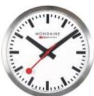

> **Bildbeschreibung:**
> Das Bild zeigt eine Armbanduhr mit einem weißen Ziffernblatt und schwarzen Ziffern. Die Uhr hat ein silbernes Gehäuse und ein silbernes Armband. Die Uhrzeit, die auf dem Ziffernblatt angezeigt wird, ist 12:00 Uhr.
> 
> Auf dem Ziffernblatt ist der Text "MONDIAIN" zu lesen, der sich über die gesamte Breite des Ziffernblatts erstreckt. Die Uhr hat zwei Zeiger: einen roten Sekundenzeiger und einen schwarzen Minutenzeiger. Der Sekundenzeiger zeigt auf die 12, während der Minutenzeiger auf die 6 zeigt.
> 
> Die Uhr wirkt sauber und ordentlich, und die Schrift auf dem Ziffernblatt ist klar und deutlich lesbar.

$$
Geg: T = 60\text{min} = 3600\text{s} \quad Ges: n \left( \frac{1}{\text{min}} \right)
$$

$$
n = \frac{N}{T} = \frac{1}{3600\text{s}} = 0,000278 \frac{1}{\text{s}} = 0,017 \frac{1}{\text{min}}
$$

8. Welche Drehzahl $n$ in $\frac{1}{\text{min}}$ erreicht ein Bohrer beim Zahnarzt, wenn der Bohrer einen Durchmesser von $d = 0,2\text{mm}$ hat und er eine Schnittgeschwindigkeit von $v_c = 190 \frac{\text{m}}{\text{min}}$ erreicht?

> **Bildbeschreibung:**
> Das Bild zeigt eine medizinische Szene, die sich auf eine zahnärztliche Behandlung konzentriert.
> 
> Im Zentrum des Bildes ist ein Zahnmodell zu sehen, das eine Reihe von Zähnen darstellt. Die Zähne sind weiß und haben eine typische Zahnform. Auf einem der Zähne ist ein zahnärztliches Werkzeug zu sehen, das eine Art von Strahl oder Spray abgibt. Dieses Werkzeug sieht aus wie ein Dentalhandstück, das in der Zahnmedizin für verschiedene Behandlungen, wie z.B. das Reinigen oder das Auftragen von Medikamenten, verwendet wird.
> 
> Der Hintergrund des Bildes ist dunkel und gibt den Eindruck eines Mundes oder einer Mundhöhle wieder, was den Kontext der zahnärztlichen Behandlung unterstreicht. Es gibt keinen sichtbaren Text im Bild. Die Position des Werkzeugs und die Art des Strahls deuten darauf hin, dass der Zahn gerade behandelt wird.

$$
Geg: v_c = 190 \frac{\text{m}}{\text{min}}, d = 0,0002\text{m} \quad Ges: n \left( \frac{1}{\text{min}} \right)
$$

$$
n = \frac{v_c}{d \cdot \pi} = \frac{190 \frac{\text{m}}{\text{min}}}{0,0002\text{m} \cdot \pi} = 302'394 \frac{1}{\text{min}} = 5040 \frac{1}{\text{s}}
$$

Skript MAPH 1. Sem. PR-GF Lehrer, V1.0
MT
34/37

---

[Seite: 36]

BBW Berufsbildungsschule Winterthur Abteilung Maschinenbau

# 5.4 Zusatzaufgaben Kapitel 5, Prüfungsvorbereitung

Lösen Sie nachfolgende Aufgaben in Ihrem Rechenheft

1. Ein Fussgänger legt in 7min eine Strecke von 580m zurück. Wie gross ist seine Geschwindigkeit in km/h? $v = 4,97$ km/h

2. Ein Intercity-Zug fährt mit einer Geschwindigkeit von 175km/h. Wieviel Zeit in s braucht er, um einen Kilometer zurückzulegen? $t = 20,6$ s

3. Bei einer Drehbank legt der Werkzeugschlitten infolge des automatischen Vorschubs 0,3m in 46s zurück. Wie gross ist die Vorschubgeschwindigkeit in m/min? $v = 0,391$ m/min

4. Ein Mofa benötigt 8s für eine Strecke von 100m. Geben Sie die Geschwindigkeit in km/h an. $v = 45$ km/h

5. Für den Vorschub von 1cm braucht ein Bohrer 8s. Wie gross ist seine Vorschubgeschwindigkeit in mm/min? $v = 75$ mm/min

6. Die Schallgeschwindigkeit in Luft beträgt ca. 340m/s. Wievielmal schneller als der Schall fliegt ein Flugzeug, das mit einer Geschwindigkeit von 1652km/h unterwegs ist? $x = 1,35$

7.* Bei Schiffen gibt man die Geschwindigkeit mit Knoten an. 1 Knoten entspricht der Geschwindigkeit von 1 Seemeile pro Stunde (1 sm/h), wobei 1 Seemeile = 1852 m entspricht. Wie lange in h, min und s braucht ein Schiff, das mit 18 Knoten fährt, um eine Strecke von 42 km zurückzulegen? $t = 1h15min36s$

8. Tragen Sie die vier nacheinander stattfindenden Bewegungen ins v/t-Diagramm ein (Einheiten beachten!).

$$
\begin{array}{l}
v_{1} = 2,78 \, \text{m/s} \quad t_{1} = 60 \, \text{s} \\
v_{2} = 4,17 \, \text{m/s} \quad t_{1} = 180 \, \text{s} \\
v_{1} = 6,94 \, \text{m/s} \quad t_{1} = 240 \, \text{s} \\
v_{1} = 1,39 \, \text{m/s} \quad t_{1} = 120 \, \text{s} \\
\end{array}
$$

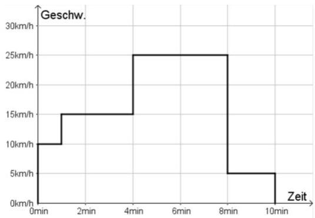

> **Bildbeschreibung:**
> Das Bild zeigt ein Geschwindigkeits-Zeit-Diagramm (Geschw.-Zeit-Diagramm).
> 
> Hier sind die wichtigsten Elemente und Details:
> 
> 1. **Achsen:**
>    - Die vertikale Achse (y-Achse) ist mit "Geschw." (Geschwindigkeit) beschriftet und gibt die Geschwindigkeit in Kilometern pro Stunde (km/h) an. Die Skala reicht von 0 km/h bis 30 km/h.
>    - Die horizontale Achse (x-Achse) ist mit "Zeit" beschriftet und gibt die Zeit in Minuten (min) an. Die Skala reicht von 0 min bis 10 min.
> 
> 2. **Geschwindigkeitsverlauf:**
>    - Zwischen 0 und 2 Minuten steigt die Geschwindigkeit von 0 km/h auf etwa 10 km/h an.
>    - Zwischen 2 und 4 Minuten steigt die Geschwindigkeit weiter von 10 km/h auf 25 km/h an.
>    - Von 4 Minuten bis etwa 8 Minuten bleibt die Geschwindigkeit konstant bei 25 km/h.
>    - Zwischen 8 und 9 Minuten fällt die Geschwindigkeit abrupt von 25 km/h auf 5 km/h.
>    - Zwischen 9 und 10 Minuten bleibt die Geschwindigkeit bei 5 km/h und fällt dann auf 0 km/h.
> 
> Das Diagramm zeigt also eine Beschleunigungsphase, eine

9. Der Mond fliegt mit einer Geschwindigkeit von 3696 Kilometer pro Stunde um die Erde. Der Radius der Umlaufbahn beträgt 384'405km. Welche "Drehzahl" in 1/min hat der Mond? $n = 2,55 \cdot 10^{-5}$ 1/min

Skript MAPH 1. Sem. PR-GF Lehrer, V1.0

MT

---

[Seite: 37]

图

BBW Berufsbildungsschule Winterthur Abteilung Maschinenbau

10. Übertragen Sie die Informationen aus dem v/t-Diagramm ins nebenstehende s/t-Diagramm (Einheiten beachten!).

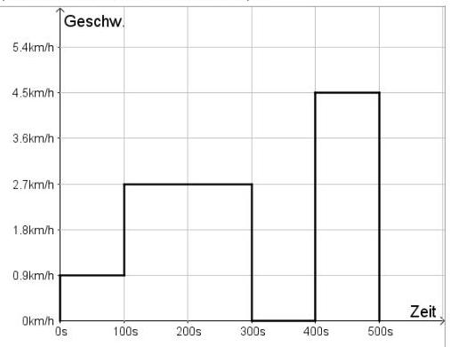

> **Bildbeschreibung:**
> Das Bild zeigt ein Diagramm, das die Geschwindigkeit (Geschw.) in Kilometern pro Stunde (km/h) über die Zeit (Zeit) in Sekunden (s) darstellt.
> 
> Hier sind die wichtigsten Elemente des Diagramms:
> 
> 1. **Achsen:**
>    - Die vertikale Achse (y-Achse) ist mit "Geschw." (Geschwindigkeit) beschriftet und gibt die Geschwindigkeit in km/h an. Die Skala reicht von 0 km/h bis 5.4 km/h.
>    - Die horizontale Achse (x-Achse) ist mit "Zeit" beschriftet und gibt die Zeit in Sekunden (s) an. Die Skala reicht von 0 s bis 500 s.
> 
> 2. **Datenverlauf:**
>    - Von 0 s bis etwa 100 s steigt die Geschwindigkeit von 0 km/h auf etwa 2.7 km/h an.
>    - Zwischen 100 s und 300 s bleibt die Geschwindigkeit konstant bei etwa 2.7 km/h.
>    - Ab 300 s bis etwa 400 s sinkt die Geschwindigkeit wieder auf 0 km/h.
>    - Zwischen 400 s und 500 s steigt die Geschwindigkeit erneut an, diesmal auf etwa 4.5 km/h, und bleibt dann bis zum Ende des Diagramms bei 500 s konstant.
> 
> Das

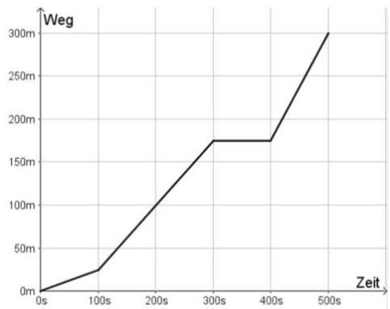

> **Bildbeschreibung:**
> Das Bild zeigt ein Diagramm, das die Beziehung zwischen Weg (Wegstrecke) und Zeit (Zeitdauer) darstellt.
> 
> Hier sind die wichtigsten Elemente des Diagramms:
> 
> 1. **Achsen:**
>    - Die vertikale Achse ist mit "Weg" beschriftet und gibt die zurückgelegte Strecke in Metern (m) an. Die Skala reicht von 0 bis 300 Metern.
>    - Die horizontale Achse ist mit "Zeit" beschriftet und gibt die Zeitdauer in Sekunden (s) an. Die Skala reicht von 0 bis 500 Sekunden.
> 
> 2. **Graph:**
>    - Der Graph beginnt im Ursprung (0m, 0s).
>    - Bis etwa 100 Sekunden steigt der Weg nur langsam an.
>    - Zwischen 100 Sekunden und 200 Sekunden steigt der Weg deutlich schneller an.
>    - Zwischen 200 Sekunden und 300 Sekunden bleibt die Steigung ähnlich, aber etwas langsamer als im vorherigen Abschnitt.
>    - Zwischen 300 Sekunden und 400 Sekunden bleibt die Steigung konstant, es gibt eine kurze Pause oder ein Plateau.
>    - Ab 400 Sekunden steigt der Weg wieder deutlich schneller an und erreicht bei 500 Sekunden etwa 300 Meter.
> 
> 3. **Interpretation:**
>    - Das Diagramm zeigt, wie sich die zurückgelegte

11. Bestimmen Sie den Durchmesser einer Riemenscheibe in mm, wenn die Drehzahl n=1500 1/min beträgt und der Riemen mit einer Geschwindigkeit von 16m/s laufen soll? $d = 204\,\text{mm}$

12. Die Antriebsräder eines Lastautos haben einen Durchmesser von 820mm. Sie machen in der Sekunde 4,2 Umdrehungen. Mit welcher Geschwindigkeit bewegt sich das Fahrzeug? $v = 38,95\,\text{km/h}$

13.* Ein Kran hat eine Seiltrommel von 380mm Durchmesser. Der Seildurchmesser beträgt 14mm. Welche Geschwindigkeit erhält die Last, wenn die Trommel 32 Umdrehungen pro Minute macht? $v_u = 0,66\,\text{m/s}$

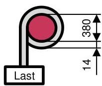

> **Bildbeschreibung:**
> Das Bild zeigt eine technische Zeichnung mit zwei Hauptkomponenten: einem kreisrunden Objekt und einem rechteckigen Objekt, das als "Last" beschriftet ist.
> 
> 1. **Kreisrundes Objekt:**
>    - Das kreisrunde Objekt ist in der Zeichnung rot markiert und befindet sich oben links.
>    - Es ist mit einer Linie verbunden, die nach unten führt und in das rechteckige Objekt mündet.
> 
> 2. **Rechteckiges Objekt (Last):**
>    - Das rechteckige Objekt ist weiß und befindet sich unten links.
>    - Es ist mit dem Text "Last" beschriftet.
>    - Eine vertikale Linie verbindet das kreisrunde Objekt mit diesem rechteckigen Objekt.
> 
> 3. **Maße:**
>    - Die vertikale Distanz zwischen dem kreisrunden Objekt und dem rechteckigen Objekt beträgt 380 Einheiten (vermutlich Millimeter).
>    - Die horizontale Distanz zwischen dem kreisrunden Objekt und dem rechten Rand des rechteckigen Objekts beträgt 14 Einheiten.
> 
> Die Zeichnung scheint eine mechanische oder strukturelle Anordnung darzustellen, bei der das kreisrunde Objekt (möglicherweise ein Lager oder eine Rolle) die Last trägt oder bewegt. Die Maße geben die relative Position der Objekte zueinander an.

14. Eine Schleifscheibe mit einem Durchmesser von d=350mm darf maximal eine Umfangsgeschwindigkeit von 30m/s erreichen. Mit welcher Drehzahl kann sie maximal betrieben werden? $n = 1637\,\text{1/min}$

15. Bei einer vorgebohrten Scheibe (Dicke = 25mm) wird auf einer Räummaschine die Bohrung mit einer 750mm langen Räumnadel zu einem Sechskantloch ausgeräumt. Die Schnittgeschwindigkeit beträgt 2,5m/min. Wie lange dauert die Räumung? $t = 18\,\text{s}$

16. Eine Hobelmaschine benötigt für den Arbeitshub 5 Sekunden bei einer Schnittgeschwindigkeit von 23m/min. Wie gross ist der Tischhub? $s = 1'917\,\text{mm}$

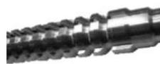

> **Bildbeschreibung:**
> Das Bild zeigt eine Nahaufnahme eines mechanischen Teils, das wie ein Gewinde oder eine Schraube aussieht. Es handelt sich um ein graues, metallisches Objekt mit einer spiralförmigen Struktur, die typisch für Gewinde ist.
> 
> Hier sind einige Details:
> 1. **Material**: Das Objekt scheint aus Metall zu bestehen, was durch den glänzenden, grauen Farbton und die typische Oberflächenstruktur von Metallteilen erkennbar ist.
> 2. **Struktur**: Die spiralförmige Struktur deutet darauf hin, dass es sich um ein Gewinde oder eine Schraube handelt. Diese Art von Struktur wird oft in mechanischen und industriellen Anwendungen verwendet, um Teile miteinander zu verbinden oder zu fixieren.
> 3. **Oberfläche**: Die Oberfläche wirkt leicht abgenutzt, was auf eine gewisse Nutzung oder Alterung hindeuten könnte.
> 
> Es gibt keinen sichtbaren Text oder weitere Kontextinformationen im Bild. Die Abbildung konzentriert sich ausschließlich auf das mechanische Teil.

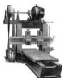

> **Bildbeschreibung:**
> Das Bild zeigt eine industrielle Maschine, die wie eine CNC-Fräse (Computerized Numerical Control Fräse) aussieht. Hier sind die wichtigsten Elemente und Details:
> 
> 1. **Maschinenaufbau:**
>    - Die Maschine besteht aus einem robusten Metallgestell, das auf einem stabilen Tisch montiert ist.
>    - Der Tisch selbst scheint aus Metall zu sein und hat eine glatte Oberfläche, die für präzise Bearbeitungen geeignet ist.
> 
> 2. **Fräskopf:**
>    - Im oberen Teil der Maschine befindet sich ein Fräskopf, der an einem vertikalen Arm befestigt ist. Dieser Arm kann in mehreren Achsen bewegt werden, um präzise Schnitte und Bearbeitungen durchzuführen.
>    - Der Fräskopf ist mit einem Werkzeug ausgestattet, das für das Fräsen von Materialien wie Holz, Metall oder Kunststoff verwendet wird.
> 
> 3. **Steuerung und Bedienelemente:**
>    - Auf der Maschine sind einige Bedienelemente und Anzeigen zu erkennen, die für die Steuerung und Überwachung der Maschine genutzt werden.
>    - Es gibt einen Bildschirm, der vermutlich zur Programmierung und Überwachung der Bearbeitungsprozesse dient.
> 
> 4. **Kontext:**
>    - Die Maschine steht in einer Werkstatt oder einem Produktionsumfeld, da sie für präzise mechanische Bearbeitungen konzipiert ist.
>    - Die CNC-Fräse

Skript MAPH 1. Sem. PR-GF Lehrer, V1.0

36/37

---

